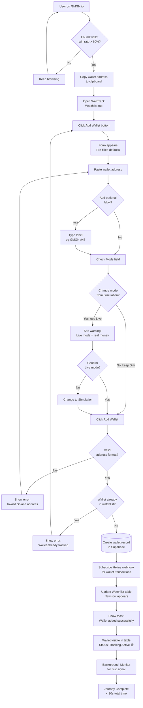

```mermaid
flowchart TD
    Start[Open WallTrack] --> DefaultTab[Dashboard tab loads]

    DefaultTab --> ScanMetrics[Scan Performance Metrics<br/>4 cards at top]
    ScanMetrics --> CheckWinRate{Win Rate<br/>> 55%?}

    CheckWinRate -->|Yes ✅| CheckPnL{PnL Total<br/>positive?}
    CheckWinRate -->|No ❌| Concern1[Mental note:<br/>Win rate declining]

    CheckPnL -->|Yes ✅| CheckCap{Capital Util<br/>< 80%?}
    CheckPnL -->|No ❌| Concern2[Mental note:<br/>Losses accumulating]

    CheckCap -->|Yes ✅| Healthy[System Healthy ✅<br/>< 10s scan]
    CheckCap -->|No ⚠️| Concern3[Mental note:<br/>Capital at risk high]

    Concern1 --> ScanPositions
    Concern2 --> ScanPositions
    Concern3 --> ScanPositions
    Healthy --> ScanPositions[Scan Active Positions table<br/>8-10 rows visible]

    ScanPositions --> CountStatus[Visual pattern scan:<br/>🟢🟢🔴🟢🟢 status badges]
    CountStatus --> ManyRed{Multiple<br/>🔴 losses?}

    ManyRed -->|Yes| InvestigateLosses[Click losing position<br/>See details in sidebar]
    ManyRed -->|No| CheckNew{New positions<br/>opened?}

    InvestigateLosses --> SidebarDetail[Sidebar shows:<br/>Wallet, Entry, Timeline]
    SidebarDetail --> Decision{Close position<br/>manually?}
    Decision -->|Yes| CloseBtn[Click Close Position]
    Decision -->|No| CloseSidebar[Close sidebar]

    CloseBtn --> ConfirmClose[Confirm close action]
    ConfirmClose --> CloseSidebar
    CloseSidebar --> CheckNew

    CheckNew -->|Yes| ReviewNew[Scan new positions:<br/>From which wallet?]
    CheckNew -->|No| AllOld[No new activity overnight]

    ReviewNew --> ClickNewPos[Click new position row]
    ClickNewPos --> SeeWallet[Sidebar shows:<br/>Wallet attribution]
    SeeWallet --> GoodWallet{Wallet performing<br/>well overall?}

    GoodWallet -->|Yes ✅| Trust[Trust autopilot:<br/>Let it run]
    GoodWallet -->|No ❌| ConsiderRemove[Mental note:<br/>Check wallet in Watchlist]

    Trust --> Done[Review complete<br/>< 30s total]
    ConsiderRemove --> SwitchTab[Switch to Watchlist tab]
    AllOld --> Done

    SwitchTab --> FindWallet[Find underperforming wallet]
    FindWallet --> ClickWalletRow[Click wallet row]
    ClickWalletRow --> SeePerf[Sidebar: Wallet performance]
    SeePerf --> RemoveDecision{Remove<br/>wallet?}

    RemoveDecision -->|Yes| RemoveBtn[Click Remove Wallet]
    RemoveDecision -->|No| KeepMonitor[Keep monitoring]

    RemoveBtn --> ConfirmRemove[Confirm removal]
    ConfirmRemove --> Done2[Review complete<br/>~60s total]
    KeepMonitor --> Done2
```

```mermaid
flowchart TD
    Start[Watchlist tab] --> ScanTable[Scan wallets table<br/>Filter: Simulation only]

    ScanTable --> SortPerf[Sort by: Win Rate ▾]
    SortPerf --> IdentifyTop[Identify top performers<br/>Win rate > 60%, PnL > 80%]

    IdentifyTop --> SelectWallet[Click wallet row]
    SelectWallet --> SidebarOpen[Sidebar opens:<br/>Wallet Performance]

    SidebarOpen --> ReviewMetrics[Review performance:<br/>Signals, Win Rate, PnL]
    ReviewMetrics --> CheckData{Enough data<br/>to validate?}

    CheckData -->|< 10 signals| NotReady[Too early to promote<br/>Keep in Simulation]
    CheckData -->|10-20 signals| MaybeReady[Borderline: Review trends]
    CheckData -->|20+ signals| Ready[Sufficient data ✅]

    NotReady --> CloseSidebar[Close sidebar]
    MaybeReady --> CheckTrend{Win rate<br/>improving?}
    CheckTrend -->|No| NotReady
    CheckTrend -->|Yes| Ready

    Ready --> CheckConsistency{Consistent performance<br/>or lucky streak?}
    CheckConsistency -->|Lucky streak| NotReady2[Wait for more data]
    CheckConsistency -->|Consistent ✅| DecidePromote{Promote to<br/>Live mode?}

    NotReady2 --> CloseSidebar
    DecidePromote -->|No| CloseSidebar
    DecidePromote -->|Yes| ClickPromote[Click Promote to Live button]

    ClickPromote --> ConfirmDialog[Confirmation dialog appears]
    ConfirmDialog --> ShowWarning[Warning shown:<br/>Live mode uses real capital]
    ShowWarning --> ShowStrategy[Current strategy shown:<br/>eg Scaling Out]
    ShowStrategy --> ShowRisk[Risk shown:<br/>Max position size, stop-loss]

    ShowRisk --> FinalConfirm{Confirm<br/>promotion?}
    FinalConfirm -->|No| Cancel[Cancel action]
    FinalConfirm -->|Yes| UpdateDB[(Update wallet record<br/>mode: 'live')]

    Cancel --> CloseSidebar

    UpdateDB --> UpdateWebhook[Helius webhook:<br/>Flag as Live]
    UpdateWebhook --> UIUpdate[Update Watchlist table<br/>Mode badge: 🔵 → 🟠]
    UIUpdate --> Toast[Show toast:<br/>Wallet promoted to Live]

    Toast --> SidebarRefresh[Sidebar refreshes:<br/>Mode: Live 🟠]
    SidebarRefresh --> NextSignal[Next signal detected...]

    NextSignal --> RealTrade[System executes<br/>REAL trade via Jupiter]
    RealTrade --> DashboardUpdate[Dashboard: New position<br/>Mode: Live 🟠]

    DashboardUpdate --> UserMonitor[User monitors closely<br/>First live trade critical]
    UserMonitor --> FirstResult{First trade<br/>outcome?}

    FirstResult -->|Profitable ✅| Confidence[Confidence boost:<br/>System works with real $]
    FirstResult -->|Loss ❌| Anxiety[Heightened monitoring:<br/>Watch next 2-3 trades]

    Confidence --> Done[Promotion complete<br/>Wallet now live]
    Anxiety --> Continue[Continue validation<br/>Consider demoting if loses]

    Continue --> Done
    CloseSidebar --> End[Promotion cancelled]
```

# UX Design Specification walltrack

**Author:** Christophe
**Date:** 2026-01-05

---

## Executive Summary

### Project Vision

WallTrack is a personal trading intelligence system for Solana memecoin copy-trading that transforms the insider's game into a systematic, transparent, and controllable operation. The core philosophy is **"Manual curation + Automated execution = Control + Efficiency"**—the operator curates a watchlist of high-performing smart money wallets discovered via GMGN, and the system automatically copies their trades with customizable exit strategies.

The unique value proposition combines zero fees (100% profit retention), complete transparency (understanding every automated decision), progressive validation (simulation-first approach), and granular control (per-wallet and per-position strategy customization). Built with AI assistance (Claude Code), WallTrack makes sophisticated trading infrastructure accessible to solo technical operators while building permanent skills in Solana/DeFi.

### Target Users

**Primary User: Christophe (System Operator)**

- **Profile**: Solo technical operator building personal trading infrastructure with AI assistance, beginner across Python/Solana/DeFi/Trading, learning by building
- **Role**: System operator performing daily high-level curation (watchlist management, strategy adjustments), zero manual trading required
- **Daily Workflow**:
  - Morning: Dashboard review focusing on active positions and 4 key metrics (Win rate, PnL total, Capital utilization, Active wallets simulation/live)
  - During Day: Curate watchlist (add/remove wallets based on performance), adjust exit strategies
  - Evening: Review daily synthesis (PnL, signals executed, circuit breaker status)
- **Journey**: Progressive validation from simulation (Weeks 1-4) → small live capital test (50€) → progressive stake increases (300€ → 500€ → 1000€+)
- **Success Vision**: Autonomous 24/7 operation with complete system mastery, sustained profitability validating the learning investment

**Technical Context**:
- UI Platform: Gradio (rapid iteration, operator-friendly)
- Usage Context: Desktop/laptop primary (morning/evening reviews), occasional mobile checks
- Complexity Tolerance: High (building complex system) but needs clarity in UI to avoid decision paralysis

### Key Design Challenges

1. **Dual-Mode Complexity Management**
   - Challenge: Visualize simulation vs live mode clearly across wallets and positions without confusion or accidents
   - Impact: Operator must never confuse simulation positions with live capital positions
   - UX Requirement: Clear visual distinction (color coding, labels, separated views) between modes

2. **Information Density in Gradio**
   - Challenge: Display rich data (positions, wallets, metrics, signals, safety scores) within Gradio's constraints without overwhelming the operator
   - Impact: Too much info = decision paralysis, too little = missed insights
   - UX Requirement: Progressive disclosure, smart defaults, scannable layouts prioritizing critical info

3. **Progressive Validation Journey Support**
   - Challenge: Interface must naturally support the operator's journey from simulation → small live test → capital scaling
   - Impact: Unclear progression path = hesitation to move to live mode or premature risk-taking
   - UX Requirement: Visual indicators of validation readiness (simulation performance thresholds), easy mode promotion per wallet

4. **Transparency for Trust Building**
   - Challenge: Show WHY decisions are made (safety scores, exit triggers, signal filtering) without cluttering the interface
   - Impact: Black box feeling = operator distrust and hesitation to rely on automation
   - UX Requirement: Contextual explanations, audit trails, decision reasoning visible on-demand

### Design Opportunities

1. **Transparency as Competitive Advantage**
   - Opportunity: Unlike black-box bots (Trojan, TradeWiz), WallTrack can show complete decision logic
   - UX Approach: Make safety scores, exit trigger reasoning, and performance analytics highly visible—transparency builds operator confidence
   - Differentiation: "I understand every trade" becomes the core UX value proposition

2. **Data-Driven Curation Interface**
   - Opportunity: Performance tracking per wallet (win rate, PnL, signal counts all/30d/7d/24h) enables systematic watchlist management
   - UX Approach: Sortable wallet analytics table, visual performance trends, quick add/remove actions based on data
   - Operator Value: Replace gut feeling with data-driven decisions on which wallets to keep/promote/remove

3. **Operator Sweet Spot: High-Level Control Without Manual Trading**
   - Opportunity: Interface balances quick high-level actions (toggle mode, adjust strategy) with deep visibility when needed
   - UX Approach: Dashboard emphasizes monitoring (positions + 4 key metrics at-a-glance), quick-action buttons for common curation tasks, detailed views accessible but not intrusive
   - Operator Experience: "I'm in control without being buried in details or forced to trade manually"

4. **Progressive Confidence Building**
   - Opportunity: UI can visually reinforce the simulation → live validation journey
   - UX Approach: Show simulation performance thresholds (e.g., "7 days stable, 55%+ win rate"), celebration moments (first live profit), progressive mode promotion flows
   - Emotional Design: Reduce anxiety about live trading by making validation milestones visible and achievable

## Core User Experience

### Defining Experience

WallTrack's core experience revolves around two primary actions that must be absolutely effortless:

**1. Morning Dashboard Review (Monitoring)**

The most frequent and critical user action—a rapid assessment of system health and trading performance:
- **Action**: Scan active positions + 4 key metrics (Win rate, PnL total, Capital utilization, Active wallets simulation/live)
- **Decision**: Immediate "Tout va bien" ✅ (continue monitoring) or "Action requise" ⚠️ (investigate/adjust)
- **Importance**: This daily ritual builds trust, maintains risk awareness, and validates confidence progression for simulation → live transitions
- **Success Criteria**: Operator gains complete situational awareness in < 30 seconds

**2. Watchlist Adjustment (Curation)**

The second core action enabling data-driven wallet management:
- **Action**: Add/Remove/Promote wallets based on performance data
- **Required Information**: 3 critical data points must be visible together:
  - Performance metrics (win rate, PnL per wallet)
  - Signal activity (recent signal counts: all/30d/7d/24h)
  - Current mode (simulation vs live status)
- **Importance**: Systematic watchlist curation replaces gut feeling with data-driven decisions, directly impacting profitability
- **Success Criteria**: Operator can make confident add/remove/promote decisions in < 2 minutes per wallet

### Platform Strategy

**Primary Platform: Gradio Web Interface**

- **Deployment**: Desktop/laptop browser (primary usage context)
- **Input Method**: Mouse/keyboard interaction (tables, dropdowns, buttons)
- **Usage Pattern**: Morning/evening reviews (5-10 minutes), quick checks during day (< 1 minute)
- **Technical Constraint**: Gradio framework limitations—no complex custom UI components, focus on clarity over visual sophistication

**Platform Decisions:**
- Web-based eliminates installation friction (accessible from any browser)
- Desktop-optimized layout (sufficient screen real estate for data density)
- No offline functionality required (trading system requires live connection)
- Responsive design not critical (primary use = desktop, mobile = occasional checks only)

### Effortless Interactions

The following interactions must feel completely natural and require zero cognitive load:

**1. Instant Status Visibility**
- Dashboard loads and displays system health in < 2 seconds
- At-a-glance status indicators (green = all good, yellow = review needed, red = action required)
- Circuit breaker status immediately visible (active/paused, reason displayed)
- No need to navigate multiple pages to assess system state

**2. One-Click Wallet Actions**
- Add wallet: Paste GMGN address → one-click add to watchlist in simulation mode
- Remove wallet: Select underperformer → one-click remove with confirmation
- Promote wallet: Simulation → Live toggle with visual confirmation and safety check
- No multi-step wizards or complex configuration for common tasks

**3. Transparent Decision Logic**
- See WHY trades executed: Safety scores, signal details, exit triggers visible without digging
- Click position → see complete audit trail (entry reason, current status, exit strategy)
- No black box mystery—every automated decision has visible justification
- Progressive disclosure: summary visible, details on-demand

**4. Zero Manual Trading**
- System executes all trades automatically based on configured strategies
- Operator monitors and curates, never manually buys/sells
- Interface reinforces monitoring role, not trading role
- Reduces stress and time commitment while maintaining control

### Critical Success Moments

These make-or-break moments determine operator confidence and system adoption:

**1. First Simulation Validation (Week 2-4)**
- **Moment**: Dashboard shows "7 days stable, 55%+ win rate" milestone achieved
- **Emotion**: Confidence building → "The system works in simulation, I understand the logic"
- **UX Support**: Visual milestone indicator, clear path to live mode activation
- **Failure Risk**: If dashboard doesn't clearly show validation progress, operator hesitates indefinitely

**2. First Live Profit (Week 5)**
- **Moment**: First position closes with +5€ realized profit (live mode)
- **Emotion**: Validation → "It works! Not theoretical, not simulated—real profit from real execution"
- **UX Support**: Celebration notification, clear profit attribution to wallet/strategy
- **Failure Risk**: If first live trade fails or profit isn't clearly visible, operator loses confidence

**3. Data-Driven Curation Decision (Ongoing)**
- **Moment**: Remove underperforming wallet based on visible analytics (e.g., win rate dropped to 35%)
- **Emotion**: Control and mastery → "I'm making systematic decisions based on data, not guessing"
- **UX Support**: Sortable performance table, trend visualization, clear remove action
- **Failure Risk**: Without clear performance data, operator keeps bad wallets or removes good ones arbitrarily

**4. Progressive Confidence Scaling (Months 2-3)**
- **Moment**: Increase capital allocation (300€ → 500€ → 1000€) based on sustained live performance
- **Emotion**: Trust and validation → "The learning investment paid off, I'm scaling profitably"
- **UX Support**: Visual capital progression, performance history, configurable capital allocation
- **Failure Risk**: If progression path unclear or performance data unreliable, operator never scales beyond initial capital

### Experience Principles

These guiding principles inform all UX design decisions for WallTrack:

**1. Transparency Builds Trust**
- Principle: Show WHY every decision is made, not just WHAT happened
- Application: Visible safety scores, exit trigger reasoning, performance attribution, audit trails
- Rationale: Operator must understand automated decisions to trust the system—transparency is competitive advantage vs black-box bots
- Design Impact: Progressive disclosure pattern—summary always visible, details accessible on-demand without clutter

**2. Data Over Gut Feeling**
- Principle: Make performance data hyper-visible for systematic curation decisions
- Application: Sortable analytics tables, win rate trends, signal activity metrics, PnL per wallet prominently displayed
- Rationale: Data-driven watchlist management outperforms intuition—replace gut feeling with evidence
- Design Impact: Analytics-first interface design, quick data access, comparison features

**3. High-Level Control Without Overwhelm**
- Principle: Quick actions for common tasks, deep visibility when needed
- Application: Dashboard emphasizes monitoring (at-a-glance metrics), quick-action buttons for curation, detailed views non-intrusive
- Rationale: Operator wants control without being buried in details or forced to trade manually
- Design Impact: Two-tier information hierarchy—critical info surface-level, comprehensive data one-click away

**4. Progressive Validation Journey**
- Principle: UI reinforces simulation → live transition with clear milestones
- Application: Visual validation thresholds (7 days stable, 55%+ win rate), mode status indicators, progressive capital scaling support
- Rationale: Reduce anxiety about live trading by making validation milestones visible and achievable
- Design Impact: Journey-aware design with celebration moments, clear next-step guidance, risk awareness indicators

## Desired Emotional Response

### Primary Emotional Goals

WallTrack's emotional design centers on four core feelings that define the operator experience:

**1. In Control (Central Emotion)**
- **Feeling**: "I master the system, I understand every decision, zero surprises"
- **Design Support**: Complete transparency (safety scores, exit triggers visible), data-driven curation interface, quick actions for adjustments without complex workflows
- **Critical For**: Operator confidence in automation—achieving control without the burden of manual trading
- **Success Indicator**: Operator can explain any automated decision and feels empowered to adjust strategies at will

**2. Confident (Data-Driven Decision Making)**
- **Feeling**: "I make the right decisions based on solid data, not gut feelings"
- **Design Support**: Performance analytics per wallet (win rate, PnL, signal counts), sortable metrics, trend visualization, clear criteria for add/remove/promote decisions
- **Critical For**: Watchlist curation decisions—systematic evidence-based management vs arbitrary choices
- **Success Indicator**: Operator removes underperforming wallets based on visible data without second-guessing

**3. Calm & Focused (Monitoring Role)**
- **Feeling**: "I monitor without stress, no frantic manual trading required"
- **Design Support**: Dashboard at-a-glance status (< 30s situational awareness), automated execution removes trading pressure, clear circuit breaker indicators for risk awareness
- **Critical For**: Sustainable daily operation—reduce cognitive load and eliminate trading anxiety
- **Success Indicator**: Morning review feels effortless, operator can check status in < 1 minute during day without disruption

**4. Trust (Progressive Validation)**
- **Feeling**: "The system works as designed, I can confidently increase stakes"
- **Design Support**: Simulation→live validation milestones visible, transparent decision logic builds credibility, audit trails for verification, celebration moments reinforce positive outcomes
- **Critical For**: Capital scaling progression—trust enables calculated risk-taking from 50€ test to 1000€+ allocation
- **Success Indicator**: Operator promotes wallets from simulation to live mode without hesitation after meeting validation thresholds

### Emotional Journey Mapping

The operator's emotional evolution follows the progressive validation journey across three distinct phases:

**Phase 1: Simulation Period (Weeks 1-4)**
- **Initial State**: Curiosity mixed with uncertainty → "Will this actually work?"
- **Building Understanding**: After 7 days stable operation → "I understand how this functions, I see the patterns"
- **Confidence Milestone**: Validation threshold achieved → "Ready for live mode, I trust the system logic"
- **Design Support**: Visual progress toward validation milestones (7 days uptime, 55%+ win rate), transparent signal processing, simulation performance clearly visible

**Phase 2: First Live Capital (Week 5)**
- **Controlled Anxiety**: First live position created → "This is real money now, not simulation..."
- **Validation Moment**: First profitable exit +5€ → "IT WORKS! Real profit from real execution!"
- **Emerging Trust**: After first success → "I can scale this, the learning investment is validated"
- **Design Support**: Clear mode indicators (simulation vs live), celebration notification for first profit, profit attribution showing which wallet/strategy succeeded

**Phase 3: Operational Maturity (Months 2+)**
- **Calm Efficiency**: Daily operation routine → "Autonomous system, I curate only, no manual trading stress"
- **Data-Driven Mastery**: Performance analytics review → "I systematically remove bad wallets, keep winners"
- **Pride & Validation**: Capital scaling success → "Investment paid off, I'm scaling profitably with complete mastery"
- **Design Support**: Performance trends over time, capital progression visualization, systematic curation workflow reinforcement

### Micro-Emotions

Critical subtle emotional states that determine UX success or failure:

**Confidence vs. Confusion**
- **Target State**: Confidence
- **Trigger Points**: Trade execution decisions, safety score calculations, exit strategy triggers
- **Design Solution**: Progressive disclosure—summary always visible, "Why?" accessible on-demand, no hidden logic
- **Failure Risk**: If operator can't explain why a trade happened, confusion → distrust

**Trust vs. Skepticism**
- **Target State**: Trust (earned progressively)
- **Trigger Points**: Simulation validation, first live profit, sustained performance
- **Design Solution**: Audit trails, transparent performance metrics, validation milestones clearly communicated
- **Failure Risk**: Black box feeling or inconsistent results → skepticism → abandonment

**Calm vs. Anxiety**
- **Target State**: Calm focus
- **Trigger Points**: Market volatility, position losses, system health concerns
- **Design Solution**: Circuit breaker status visible, risk indicators clear, automated execution removes manual pressure
- **Failure Risk**: Unclear system state or hidden problems → anxiety → manual intervention undermines automation

**Accomplishment vs. Frustration**
- **Target State**: Accomplishment
- **Trigger Points**: Successful curation decisions, profitable exits, milestone achievements
- **Design Solution**: Clear feedback for actions (wallet removed, strategy adjusted), celebration moments (first profit, validation achieved)
- **Failure Risk**: Actions don't produce visible results or unclear impact → frustration → disengagement

### Design Implications

Emotional goals directly inform specific UX design decisions:

**1. In Control → Transparency Design Pattern**
- **Implementation**: All automated decisions include visible reasoning (safety score breakdown, exit trigger logic, signal filter criteria)
- **Visual Approach**: "Why?" tooltips, expandable detail panels, audit log accessible from any position/signal
- **Interaction**: Click any position → see complete decision trail (entry reason, current strategy, exit conditions)
- **Avoid**: Hidden algorithms, unexplained actions, "trust us" black boxes

**2. Confident → Analytics-First Interface**
- **Implementation**: Performance data prioritized in Watchlist view (win rate, PnL, signal counts visible in table)
- **Visual Approach**: Sortable columns, trend indicators (↑↓), quick-filter options (show only underperformers)
- **Interaction**: Click wallet → performance chart, comparison to other wallets, clear remove/promote actions
- **Avoid**: Gut-feel decisions, hidden performance data, unclear curation criteria

**3. Calm → At-A-Glance Status Design**
- **Implementation**: Dashboard hero section with 4 key metrics (Win rate, PnL, Capital, Active wallets) + color-coded health status
- **Visual Approach**: Green/Yellow/Red status indicators, minimal navigation required for core monitoring
- **Interaction**: Single-page dashboard load shows complete situational awareness, no drilling required for health check
- **Avoid**: Multi-page navigation for status, buried critical info, unclear system state

**4. Trust → Progressive Validation Reinforcement**
- **Implementation**: Visual milestone tracking (7 days uptime, 55%+ win rate thresholds), celebration notifications (first profit achieved)
- **Visual Approach**: Progress bars toward validation goals, achievement badges, historical performance context
- **Interaction**: Dashboard shows "Simulation Validation: 5/7 days, 58% win rate" → clear path to live mode confidence
- **Avoid**: Hidden validation criteria, unclear readiness signals, no positive reinforcement

### Emotional Design Principles

Guiding principles that connect emotional goals to every UX decision:

**1. Transparency Defeats Anxiety**
- **Principle**: Show the complete decision logic to eliminate uncertainty and build trust
- **Application**: Every automated action has visible reasoning, no mystery about why trades execute or fail
- **Emotional Impact**: Reduces anxiety (I know what's happening), builds trust (I can verify), increases confidence (I understand the system)
- **Design Rule**: If the operator asks "Why?" the answer should be one click away, not buried in logs

**2. Data Empowers, Gut Feeling Misleads**
- **Principle**: Make performance data hyper-visible to enable systematic decision-making
- **Application**: Win rates, PnL, signal counts prominently displayed, sortable, comparable across wallets
- **Emotional Impact**: Builds confidence (data-driven choices), reduces second-guessing (evidence-based), creates mastery feeling (I know which wallets work)
- **Design Rule**: Critical curation data should be visible without clicking—defaults show what matters

**3. Monitoring, Not Trading**
- **Principle**: Interface reinforces the operator role as system curator, not active trader
- **Application**: Dashboard emphasizes status monitoring, quick curation actions, zero manual buy/sell buttons
- **Emotional Impact**: Reduces stress (no trading pressure), increases calm (automation works), maintains control (I curate strategies)
- **Design Rule**: Operator actions should be high-level (adjust strategy, promote wallet), never low-level (execute trade now)

**4. Progressive Validation Builds Confidence**
- **Principle**: Visual reinforcement of simulation → live journey reduces risk anxiety
- **Application**: Milestones visible (7 days stable, 55%+ win rate), celebration moments (first profit), clear promotion path
- **Emotional Impact**: Reduces fear of live trading (validation proven), builds trust (system works), creates pride (I built this, it's profitable)
- **Design Rule**: Every validation milestone should be visible and celebrated—no silent achievements

**5. Failure Transparency Maintains Trust**
- **Principle**: When things go wrong, show why clearly to preserve operator confidence
- **Application**: Failed trades show reason (safety score too low, slippage exceeded), circuit breakers explain trigger (drawdown 20%, win rate 38%)
- **Emotional Impact**: Maintains trust despite losses (I understand what happened), preserves control feeling (I can adjust), prevents panic (system protected me)
- **Design Rule**: Errors and failures are learning opportunities—never hide problems, explain them clearly

## UX Pattern Analysis & Inspiration

### Inspiring Products Analysis

**Primary Inspiration: Notion Database Views**

Notion serves as the primary UX reference for WallTrack's operator interface, specifically its database view system which elegantly solves the challenge of displaying complex relational data with multiple perspectives and quick actions.

**What Notion Does Well:**

1. **Flexible Database Views**
   - Table View: Sortable columns, inline filters, row-level actions
   - Gallery View: Visual cards with key info, color-coded status, scannable layout
   - Detail View: Click row → sidebar panel appears with complete entity details and contextual actions
   - Seamless view switching without losing context or requiring page reloads

2. **Database-First UI Philosophy**
   - UI directly reflects underlying data model—what you see matches database structure
   - Changes propagate immediately across all views (table update → gallery update simultaneously)
   - Transparency in data relationships (linked databases, rollups, formulas visible)
   - No "black box" transformations—data manipulation logic is visible and understandable

3. **Progressive Disclosure Pattern**
   - Table view shows essential columns by default, additional columns accessible but hidden
   - Click row → sidebar reveals full entity details without navigating away
   - Forms appear contextually (add new, edit existing) without modal overlays that block content
   - Information hierarchy clear: scannable summary → one-click details

4. **Quick Actions & Forms**
   - Inline editing where appropriate (toggle status, quick text edits)
   - Structured forms for complex operations (add new database entry)
   - Action buttons contextual to entity (appear in sidebar detail view)
   - Minimal clicks from decision to action (select row → sidebar → action button)

5. **Tab-Based Navigation**
   - Clear top-level organization (different databases = different tabs/pages)
   - No deep navigation hierarchies—flat structure prioritizes speed
   - Context maintained when switching tabs (selection state, filters preserved where logical)

**Why This Works for WallTrack:**

- **Operator Role Alignment**: Like Notion users managing databases, WallTrack operator curates data (wallets, positions) not executing manual trades
- **Data Complexity**: Multiple entities (wallets, positions, signals, tokens) with relationships—Notion's relational model maps perfectly
- **Quick Decision-Making**: Table views support rapid scanning + data comparison, sidebar supports deep investigation
- **Transparency Match**: Database-first UI philosophy aligns with WallTrack's "Transparency Builds Trust" principle
- **Gradio Feasibility**: Notion patterns can be implemented with native Gradio components (Dataframe, Tabs, Column visibility toggling)

### Transferable UX Patterns

**Pattern 1: Standardized Entity Views (Notion → Gradio)**

**What to Transfer:**
- Each business entity (Wallets, Positions, Signals, Tokens, Performance) gets 4 standard views:
  1. **Table Complète** (full database columns for deep analysis)
  2. **Table Simple** (5-7 essential columns for daily operations)
  3. **Galerie** (visual cards with color-coded status for at-a-glance overview)
  4. **Form** (add new / edit existing entity with validation)

**Gradio Implementation:**
- `gr.Dataframe(interactive=True)` for table views with sortable columns
- `gr.Radio(["Simple", "Full", "Gallery"])` for view mode switching
- `gr.Gallery()` or grid of `gr.Markdown()` cards for gallery view
- `gr.Form()` with appropriate fields for add/edit operations

**Why This Works:**
- Standardization reduces cognitive load—operator learns pattern once, applies to all entities
- View flexibility supports different use cases (quick check vs deep analysis)
- Maps directly to Supabase tables—database schema → UI views naturally

**Pattern 2: Sidebar Detail View (Click Row → Contextual Actions)**

**What to Transfer:**
- Click any row in table → sidebar appears on right with:
  - Complete entity details (all fields, not just table columns shown)
  - Performance charts / trend visualization where applicable
  - Audit trail / history
  - Contextual action buttons (Remove, Promote, Override Strategy, Close Position)

**Gradio Implementation:**
```python
with gr.Row():
    with gr.Column(scale=3):
        table = gr.Dataframe()  # Main table
    with gr.Column(scale=1, visible=False) as sidebar:
        detail_md = gr.Markdown()  # Entity details
        actions_row = gr.Row()  # Action buttons

table.select(show_sidebar, outputs=[sidebar, detail_md, actions_row])
```

**Why This Works:**
- Avoids navigation overhead—operator stays in context, no page loads
- Progressive disclosure—surface info in table, depth in sidebar
- Action proximity—decision (in table) to action (sidebar button) is immediate

**Pattern 3: Tab-Based Navigation (3 Primary Views)**

**What to Transfer:**
- Flat navigation structure with 3 main tabs:
  1. **Dashboard** (monitoring: positions + 4 key metrics)
  2. **Watchlist** (curation: wallet management + performance analytics)
  3. **Config** (system: parameters, circuit breaker status, webhook health)

**Gradio Implementation:**
```python
with gr.Blocks() as app:
    with gr.Tabs():
        with gr.Tab("Dashboard"): ...
        with gr.Tab("Watchlist"): ...
        with gr.Tab("Config"): ...
```

**Why This Works:**
- Matches operator workflow: Morning review (Dashboard) → During day (Watchlist curation) → Config adjustments as needed
- No deep hierarchies—everything is 1 tab click away
- Cognitive simplicity—3 clear contexts, not 10+ menu items

**Pattern 4: Database-to-UI Direct Mapping**

**What to Transfer:**
- UI views directly reflect Supabase table structure
- Example: `wallets` table columns → Watchlist Table Complète columns (1:1 mapping)
- Modifications in UI → immediate database updates → reflected across all views

**Gradio Implementation:**
- Fetch Supabase table → `pd.DataFrame` → `gr.Dataframe()`
- User edits row → trigger Supabase update → refresh all views showing that data
- No hidden transformations—operator sees database state directly

**Why This Works:**
- Transparency principle—"What I see is what's in the database"
- Debugging simplified—if data looks wrong in UI, check database directly
- Matches operator's beginner learning path—clear connection between data layer and UI layer

**Pattern 5: Quick Actions via Forms + Inline Buttons**

**What to Transfer:**
- Add Wallet: `gr.Form()` with address field, mode dropdown, default strategy selection → Submit button
- Remove Wallet: Select row in table → sidebar appears → Remove button with confirmation
- Promote Wallet (Sim → Live): Toggle switch in sidebar detail view with visual confirmation

**Gradio Implementation:**
- Forms for multi-field operations (Add Wallet, Configure Strategy)
- Inline buttons for single-action operations (Remove, Promote, Close Position)
- Confirmation dialogs for destructive actions (Remove wallet, Close position early)

**Why This Works:**
- Matches Notion's action pattern—complex operations use forms, simple operations use buttons
- Reduces clicks for frequent operations (promote wallet = 1 toggle, not multi-step wizard)
- Prevents accidents—destructive actions require confirmation

### Anti-Patterns to Avoid

**Anti-Pattern 1: Multi-Step Wizards for Simple Operations**

**Description:** Requiring users to navigate through multiple screens/modals for operations that could be single-action.

**Example to Avoid:** Add Wallet wizard with steps: 1) Enter address, 2) Select mode, 3) Configure strategy, 4) Confirm → Requires 4 clicks + 3 page transitions.

**Why It Fails for WallTrack:**
- Conflicts with "Quick Actions" principle—watchlist curation should be fast
- Operator performs add/remove operations multiple times per week—friction compounds
- Breaks flow—operator discovers wallet on GMGN, switches to WallTrack, wants instant add

**Correct Approach:** Single form with all fields (address, mode dropdown, strategy selection) → one Submit button. Add wallet in < 30 seconds.

**Anti-Pattern 2: Custom UI Components Instead of Gradio Native**

**Description:** Building custom JavaScript/React components for functionality that Gradio native components can provide.

**Example to Avoid:** Custom data table with sorting/filtering implemented in JavaScript instead of using `gr.Dataframe(interactive=True)`.

**Why It Fails for WallTrack:**
- Maintainability burden—operator is learning Python, not a front-end expert
- Gradio update compatibility—custom components may break on Gradio version upgrades
- Development speed—MVP requires rapid iteration, custom UI slows this down

**Correct Approach:** Use Gradio native components exclusively. If functionality doesn't exist in Gradio, simplify the requirement rather than build custom solutions.

**Anti-Pattern 3: Deep Navigation Hierarchies**

**Description:** Multi-level menus requiring users to drill down through categories to find functionality.

**Example to Avoid:** Menu structure like: Settings → Trading → Wallets → Watchlist → View → Performance (5 levels deep).

**Why It Fails for WallTrack:**
- Conflicts with "Effortless Interactions" principle—operator should access any function in < 2 clicks
- Cognitive overhead—remembering navigation paths adds mental load
- Slow daily workflow—morning review should be instant, not navigating menus

**Correct Approach:** Flat tab structure (Dashboard, Watchlist, Config) with all functionality accessible within 1-2 clicks. No sub-menus, no nested categories.

**Anti-Pattern 4: Hidden Performance Data Requiring Clicks to Reveal**

**Description:** Burying critical decision-making data (win rates, PnL, signal counts) in detail views instead of showing in main table.

**Example to Avoid:** Watchlist table shows only wallet address + mode → must click each wallet to see performance metrics in sidebar.

**Why It Fails for WallTrack:**
- Conflicts with "Data Over Gut Feeling" principle—curation decisions require visible performance comparison
- Inefficient workflow—operator needs to see win rates for all wallets simultaneously to identify underperformers
- Breaks Notion inspiration—Notion shows key data in table view, details in sidebar for additional context

**Correct Approach:** Table Simple view shows essential decision-making data (Address, Mode, Win Rate, PnL, Signals 7d). Sidebar provides additional context (charts, history) but core data is always visible.

**Anti-Pattern 5: Modal Dialogs Blocking Content**

**Description:** Using modal pop-ups that block the entire interface for actions or details.

**Example to Avoid:** Click wallet in table → modal overlay covers entire screen with wallet details → must close modal to see table again.

**Why It Fails for WallTrack:**
- Breaks context—operator loses view of table data when reviewing wallet details
- Prevents comparison—can't compare wallet A details with wallet B without closing/reopening modals
- Violates progressive disclosure—details should be additive (sidebar), not replacement (modal)

**Correct Approach:** Sidebar pattern from Notion—click row → sidebar appears alongside table. Operator can see both table context and row details simultaneously. No modal overlays for standard operations.

### Design Inspiration Strategy

**What to Adopt (Direct Transfer from Notion):**

1. **4 Standard Views per Business Entity**
   - Adopt: Table Complète, Table Simple, Galerie, Form pattern for all 5 entities (Wallets, Positions, Signals, Tokens, Performance)
   - Rationale: Standardization across entities reduces learning curve, supports different operator needs (quick check vs deep analysis)
   - Implementation: Create reusable Gradio component pattern, apply consistently

2. **Sidebar Detail View on Row Selection**
   - Adopt: Click any table row → sidebar appears with entity details + contextual actions
   - Rationale: Preserves context (table visible), supports progressive disclosure, matches Notion mental model
   - Implementation: `gr.Column(visible=False)` toggled to `visible=True` on row select event

3. **Tab-Based Flat Navigation**
   - Adopt: 3 main tabs (Dashboard, Watchlist, Config) with no sub-navigation
   - Rationale: Matches operator workflow phases, prevents navigation overhead, aligns with Gradio's tab component strengths
   - Implementation: `gr.Tabs()` with 3 `gr.Tab()` blocks

**What to Adapt (Modify for WallTrack Specifics):**

1. **Gallery View → Color-Coded Status Cards**
   - Adapt: Notion's gallery shows flexible card layouts; WallTrack needs health status emphasis
   - Modification: Add traffic light color coding (green=healthy, yellow=review, red=action required) to gallery cards
   - Rationale: Operator needs instant visual health check—color coding supports "< 30s situational awareness" goal

2. **Table Inline Editing → Restricted to Non-Critical Fields**
   - Adapt: Notion allows inline editing of any field; WallTrack restricts to prevent accidents
   - Modification: Only allow inline editing for non-destructive operations (wallet notes, custom labels). Mode toggle (Sim/Live) and Remove action require sidebar + confirmation.
   - Rationale: Safety—operator must never accidentally toggle simulation → live mode or remove wallet via misclick

3. **Forms → Pre-Filled Defaults for Speed**
   - Adapt: Notion forms start empty; WallTrack pre-fills common choices
   - Modification: Add Wallet form defaults to: Mode=Simulation, Default Strategy=Preset 1 (scaling out + stop-loss)
   - Rationale: Speed—operator adds wallets frequently during discovery, pre-filling sensible defaults reduces friction

**What to Avoid (Patterns That Don't Fit):**

1. **Notion's Flexible Property Types**
   - Avoid: Notion allows users to create custom property types (relation, formula, rollup) dynamically
   - Reason: WallTrack has fixed database schema—operator doesn't need to customize data model, only view/filter it
   - Alternative: Provide pre-configured views (Table Simple, Table Complète) that show relevant column combinations

2. **Collaborative Features (Comments, @mentions)**
   - Avoid: Notion's commenting and team collaboration features
   - Reason: Single-user system (solo operator)—no collaboration needed, adds UI complexity without value
   - Alternative: Audit trail shows decision history for operator's own reference, but no @mention or comment threads

3. **AI-Generated Content (Notion AI)**
   - Avoid: Notion's AI writing assistant features
   - Reason: WallTrack operator needs data visualization and control interfaces, not content generation
   - Alternative: Focus on transparent data display and quick actions—AI adds no value to copy-trading curation workflow

**Implementation Priority (MVP Focus):**

**High Priority (MVP Must-Haves):**
- Tab navigation (Dashboard, Watchlist, Config)
- Table Simple views for Wallets and Positions (core entities)
- Sidebar detail view for Wallets (performance charts, promote/remove actions)
- Add Wallet form with pre-filled defaults
- Color-coded status indicators on Dashboard

**Medium Priority (Post-MVP):**
- Table Complète views for all entities (deep analysis capability)
- Gallery views for Positions (visual card alternative to table)
- Table Simple views for Signals and Tokens (audit/debug support)
- Advanced filtering on tables (show only underperformers, live-only, etc.)

**Low Priority (Future Enhancements):**
- Custom view configurations (operator saves preferred column combinations)
- Export data functionality (download table as CSV)
- Advanced sidebar charts (interactive performance trends, comparison across wallets)

**This strategy ensures WallTrack maintains Notion's UX strengths (database views, progressive disclosure, quick actions) while adapting to operator-specific needs (safety, transparency, monitoring focus) and respecting Gradio's native component constraints.**


## Design System Foundation

### Design System Choice

**Selected Approach: Custom Gradio Theme (gr.themes.Soft-based)**

WallTrack utilise un thème Gradio personnalisé basé sur `gr.themes.Soft`, offrant l'équilibre optimal entre rapidité de développement et contrôle des aspects visuels critiques pour un outil de trading intelligence.

**Core Theme Components:**

- **Base Theme**: `gr.themes.Soft` - optimisé pour lisibilité de données
- **Primary Hue**: Blue - évoque confiance et professionnalisme
- **Secondary Hue**: Slate - neutre, minimise distraction
- **Custom Variables**: Couleurs dual-mode et statuts métier

### Rationale for Selection

**1. Technical Constraints Alignment**

- Gradio natif uniquement → thème Gradio natif
- Solo operator → configuration simple, pas de design system externe
- Python-centric stack → configuration programmatique directe

**2. Speed vs Control Trade-off**

- **Speed**: `gr.themes.Soft` fournit defaults éprouvés (accessibilité, responsive, contraste)
- **Control**: Customization ciblée des couleurs critiques (dual-mode, statuts)
- **Balance**: 30 lignes de config vs 0 lignes (default) ou 500+ lignes (full custom)

**3. Dual-Mode Visual Distinction**

- **Simulation Mode**: Blue/cyan tones (évoque "test", "sandbox")
- **Live Mode**: Orange/amber accents (évoque "attention", "real money")
- **Status Indicators**:
  - Green: Positive signals, profitable positions
  - Yellow: Warnings, degrading performance
  - Red: Errors, losses, circuit breakers

**4. Data Readability Priority**

- High-density data displays (tables, metrics dashboards)
- `gr.themes.Soft` optimized for text/number legibility
- Light background with high contrast text
- Generous whitespace for scanning

**5. Future-Proof Flexibility**

- Easy to adjust colors without touching component code
- Can migrate to fully custom theme later if needed
- Gradio theme API stable and well-documented

### Implementation Approach

**Theme Module Structure:**

```python
# src/walltrack/ui/theme.py

import gradio as gr

def create_walltrack_theme():
    """
    Creates WallTrack custom Gradio theme.

    Design Principles:
    - Clarity over aesthetics
    - Dual-mode visual distinction
    - Status color consistency
    - Data readability first
    """
    theme = gr.themes.Soft(
        primary_hue="blue",
        secondary_hue="slate",
        neutral_hue="slate",
        font=gr.themes.GoogleFont("Inter"),  # Clean, readable
        spacing_size=gr.themes.sizes.spacing_md,
        radius_size=gr.themes.sizes.radius_sm,
    ).set(
        # Dual-mode colors (applied via component props)
        button_primary_background_fill="*primary_500",
        button_secondary_background_fill="*warning_500",

        # Status colors
        color_accent_soft="*success_50",
        stat_background_fill="*warning_50",
        error_background_fill="*error_50",

        # Table/data optimization
        table_border_color="*neutral_200",
        table_row_focus="*primary_50",
    )

    return theme

# Usage in app
# with gr.Blocks(theme=create_walltrack_theme()) as app:
```

**Color System Documentation:**

| Color Variable | Usage | RGB/Hex |
|---|---|---|
| `*primary_500` | Simulation buttons, primary actions | Blue #3B82F6 |
| `*warning_500` | Live mode indicators, caution states | Amber #F59E0B |
| `*success_50/500` | Profitable positions, positive signals | Green #10B981 |
| `*error_50/500` | Losses, errors, circuit breakers | Red #EF4444 |
| `*neutral_200` | Borders, dividers | Slate #E2E8F0 |

**Component-Level Application:**

```python
# Example: Dual-mode button styling
with gr.Row():
    if mode == "simulation":
        execute_btn = gr.Button("Execute (Simulation)", variant="primary")
    else:
        execute_btn = gr.Button("Execute (LIVE)", variant="secondary")

# Example: Status-based metric display
with gr.Row():
    if win_rate >= 0.60:
        gr.Markdown(f"✅ **Win Rate: {win_rate:.1%}**")
    elif win_rate >= 0.50:
        gr.Markdown(f"⚠️ **Win Rate: {win_rate:.1%}**")
    else:
        gr.Markdown(f"❌ **Win Rate: {win_rate:.1%}**")
```

**Integration Points:**

1. **Application Bootstrap**: `src/walltrack/ui/app.py` imports and applies theme
2. **Component Library**: `src/walltrack/ui/components/` use theme variables via props
3. **Status Displays**: Health indicators, signal badges use theme status colors
4. **Mode Switching**: UI updates button variants based on `mode` config

### Customization Strategy

**MVP Phase (Current):**

- ✅ Base `gr.themes.Soft` theme
- ✅ Dual-mode color distinction (blue simulation, amber live)
- ✅ Status color palette (green/yellow/red)
- ✅ Typography (Inter font)
- ⬜ Fine-tuning spacing/radius if needed

**Post-MVP Enhancements:**

1. **Dark Mode** (optional, low priority)
   - Create `create_walltrack_theme_dark()` variant
   - User preference toggle in Config tab
   - Preserves dual-mode distinction with adjusted luminance

2. **Advanced Status Colors** (if signals complexity increases)
   - Gradations beyond green/yellow/red
   - Signal strength visualization (opacity, saturation)

3. **Custom CSS Overrides** (only if Gradio theme API insufficient)
   - Inject via `gr.Blocks(css="...")`
   - Target specific classes for fine control
   - Document all overrides for maintenance

**Non-Goals (YAGNI):**

- ❌ External design system (Material, Ant, etc.) - incompatible avec Gradio natif
- ❌ Component library beyond Gradio - adds complexity, no benefit
- ❌ Complex theming engine - solo operator, simple is better
- ❌ Brand identity system - internal tool, function > form

**Maintenance Approach:**

- **Version Pin**: Pin Gradio version to avoid breaking theme changes
- **Theme File Ownership**: `theme.py` is single source of truth
- **Color Constants**: Document all custom colors with purpose
- **Test Theme**: Visual regression testing via Playwright screenshots (Dashboard, Watchlist, Config tabs)


## 2. Defining Core Experience

### 2.1 Defining Experience

**"Discover → Add → Autopilot"**

WallTrack's defining experience is the seamless transition from wallet discovery to automated trade execution. The core interaction that users will describe to their friends is: **"I find a smart money wallet on GMGN, add it to WallTrack in 30 seconds, and the system automatically copies their trades while I sleep."**

This interaction makes users feel successful because it transforms manual, exhausting trading into high-level strategic curation. The operator never executes a single trade manually—they curate *who* to follow, and the system mirrors trades automatically with customizable exit strategies.

**The Magic Moment:**

The first time a profitable trade is copied automatically without operator intervention. User wakes up, checks Dashboard, sees:

```
✅ New Position Opened (Automated)
Wallet: vBn8x...k2Lp (GMGN Rank #47)
Token: $BONK
Entry: 0.000012 SOL | Current: 0.000018 SOL (+50%)
Mode: Simulation | Strategy: Scaling Out + Stop-Loss
```

This moment validates the entire premise: **"The system works while I don't."**

### 2.2 User Mental Model

**Social Media "Follow" Metaphor**

Users approach WallTrack with a mental model borrowed from social media platforms:

- **GMGN = Discovery Feed**: Browse high-performing wallets (like browsing recommended accounts)
- **WallTrack Watchlist = Following List**: Curate wallets to track (like following accounts)
- **Positions = Activity Feed**: See what wallets are doing (like seeing posts from followed accounts)
- **Promote/Remove = Engagement Actions**: Adjust watchlist based on performance (like unfollowing underperformers)

**Key Mental Model Differences:**

Unlike social media, WallTrack's "follow" has real consequences:

- **Financial Stakes**: Following a wallet = risking capital on their trades
- **Mode Distinction**: "Following" in Simulation (practice) ≠ "Following" in Live (real money)
- **Performance-Based Curation**: Unlike social media loyalty, wallets are added/removed purely on data (win rate, PnL, consistency)

**User Expectations:**

1. **Instant Activation**: Add wallet → tracking starts immediately (< 30s, like clicking "Follow" on Twitter)
2. **Clear Confirmation**: Visual feedback confirms wallet is now tracked (similar to "Following" badge appearing)
3. **Autopilot Execution**: First trade copied automatically without user needing to monitor or confirm

**Where Users Get Confused:**

- **Dual-Mode Complexity**: "Am I following this wallet in Simulation or Live?" → Must be crystal clear at Add Wallet moment
- **Delayed First Signal**: User adds wallet, expects immediate action, but wallet might not trade for hours/days → Need status indicator "Tracking Active, Waiting for Signal"
- **Exit Strategy Mystery**: "The system entered a trade... when will it exit?" → Transparency via strategy labels and expected behavior

### 2.3 Success Criteria

**Core Experience Success Indicators:**

1. **Speed - Add Wallet Flow < 30 seconds**
   - From "Copy wallet address from GMGN" to "Wallet tracked in WallTrack" must be < 30s
   - Form pre-filled with sensible defaults (Mode: Simulation, Strategy: Preset 1)
   - Success: User completes Add Wallet without needing documentation

2. **Confirmation - Immediate Visual Feedback**
   - Wallet appears in Watchlist Table Simple view within 5 seconds
   - Status badge shows "Tracking Active" (green indicator)
   - Sidebar detail shows "Waiting for Signal" state with live countdown/activity
   - Success: User feels confident the system is working

3. **Autopilot Trust - First Trade Copied Without Intervention**
   - System detects wallet trade via Helius webhook
   - Position opened automatically, appears on Dashboard
   - Notification sent (optional, future): "Trade copied from Wallet vBn8x..."
   - Success: User says "this just works"

**User Feels "Smart or Accomplished" When:**

- Adding a high-performing wallet discovered via research (GMGN top 100)
- Seeing first automated position open with clear rationale (wallet name, entry price, strategy)
- Reviewing morning Dashboard: multiple positions managed automatically overnight
- Promoting a wallet from Simulation → Live after validating performance

**Critical Feedback Loops:**

- **Add Wallet**: Immediate appearance in Watchlist + "Tracking Active" badge
- **First Signal Detected**: Position appears on Dashboard with wallet attribution
- **Exit Executed**: Position closes, PnL calculated, wallet performance metrics updated
- **Underperformance**: Wallet win rate drops below threshold → yellow warning badge in Watchlist

### 2.4 Novel UX Patterns

**Hybrid: Familiar Patterns + Novel Twist**

WallTrack combines **established social media patterns** (follow/unfollow, curation feeds) with **novel financial automation patterns** (dual-mode tracking, strategy inheritance).

**Established Patterns (Leverage User Familiarity):**

1. **"Follow" Metaphor for Wallet Tracking**
   - Users already understand: Browse → Follow → See Activity
   - WallTrack adaptation: GMGN → Add Wallet → See Positions
   - No user education needed—metaphor is intuitive

2. **Table + Sidebar Detail (Notion Pattern)**
   - Users familiar with database views: Click row → See details
   - WallTrack adaptation: Click wallet row → Sidebar shows performance charts, actions (Promote, Remove)
   - Gradio implementation: `gr.Dataframe.select()` → toggle `gr.Column(visible=True)`

**Novel Patterns (Require User Education):**

1. **Dual-Mode Wallet Tracking (Simulation vs Live)**
   - **What's Novel**: Same wallet can be tracked in two modes simultaneously
   - **User Education Strategy**:
     - Visual distinction: Blue labels (Simulation), Amber labels (Live)
     - Add Wallet form: Mode selector with tooltip "Start in Simulation to test wallet performance"
     - Promote Wallet action: Clear confirmation dialog "Move Wallet vBn8x... from Simulation → Live?"
   - **Familiar Metaphor**: Like "Drafts vs Published" in content platforms

2. **Strategy Inheritance (Wallet → Position)**
   - **What's Novel**: Exit strategy defined at wallet level, inherited by all positions from that wallet
   - **User Education Strategy**:
     - Add Wallet form: "Default Strategy" dropdown with preset descriptions (e.g., "Scaling Out: Exit 50% at 2x, 50% at 3x")
     - Position detail sidebar: Shows inherited strategy with "From Wallet: vBn8x... (Strategy: Scaling Out)"
     - Future: Override strategy per-position if needed
   - **Familiar Metaphor**: Like "Folder settings inherited by files" in file systems

**Innovation Within Familiar Patterns:**

- **Watchlist Table = Smart Curation Interface**: Beyond static tables, WallTrack's Watchlist dynamically updates performance metrics, enabling data-driven follow/unfollow decisions
- **Dashboard = Monitoring Command Center**: Unlike passive feeds, Dashboard shows *consequences* of followed wallets (active positions, PnL, capital at risk)

### 2.5 Experience Mechanics

**Core Experience Flow: "Add Wallet → Automatic Trade Mirroring"**

#### 1. Initiation: "Add Wallet" Action

**Trigger:**
- User browses GMGN, finds high-performing wallet (e.g., rank #47, 70% win rate, 8.5x avg profit)
- Copies wallet address to clipboard
- Navigates to WallTrack Watchlist tab
- Clicks **"Add Wallet"** button

**System Response:**
- Add Wallet form appears (modal or sidebar)
- Form pre-filled with defaults:
  - **Mode**: Simulation (blue radio button selected)
  - **Default Strategy**: Preset 1 - Scaling Out + Stop-Loss (dropdown selected)
  - **Wallet Address**: Empty (focus on input)
  - **Label** (optional): Empty placeholder "e.g., GMGN Rank #47"

**User Action:**
- Pastes wallet address (validation: Solana address format)
- Optionally adds label (e.g., "GMGN #47 - Memecoin Hunter")
- Clicks **"Add Wallet"** button

**Validation:**
- Address format check (Solana base58)
- Duplicate check (wallet not already in watchlist)
- Mode confirmation (if Live mode selected, show warning: "Live mode will use real capital")

**Time: 20-30 seconds from click to confirmation**

#### 2. Interaction: Wallet Tracked in System

**System Actions (Immediate - < 5s):**

1. **Database Insert**: Wallet record created in Supabase `wallets` table
   - `address`, `mode`, `default_strategy`, `label`, `tracking_status: 'active'`, `added_at: now()`

2. **Helius Webhook Subscription**: Subscribe to wallet address for transaction notifications
   - Webhook type: `accountTransfer` for this wallet address
   - Status confirmation: Helius returns subscription ID

3. **UI Update**: Watchlist table refreshes, new wallet appears
   - Row added to Watchlist Table Simple view
   - Columns: Label | Address (truncated) | Mode | Status | Signals (0) | Win Rate (-) | PnL (-)
   - Status badge: 🟢 **Tracking Active** (green)

**User Feedback:**
- Form closes, returns to Watchlist tab
- New wallet visible in table (top row, sorted by `added_at` desc)
- Toast notification (optional): "Wallet added successfully. Tracking active, waiting for signals."

**Background Process (Ongoing):**
- Discovery Worker polls wallet for existing positions (optional: backfill recent trades)
- System monitors Helius webhook endpoint for incoming signals

#### 3. Feedback: "Waiting for Signal" → "Signal Detected"

**State 1: Waiting for Signal (0-48 hours)**

**User Checks Watchlist:**
- Wallet row shows:
  - Status: 🟢 **Tracking Active**
  - Signals: 0
  - Win Rate: - (no data yet)
  - Last Activity: "Waiting for signal" (gray text)

**User Clicks Wallet Row:**
- Sidebar appears with detail view
- **Status Section**: "🟢 Tracking Active - No signals detected yet"
- **Activity Timeline**: "Added 2 hours ago | Monitoring transactions..."
- **Actions**: Remove Wallet (button), Edit Strategy (future)

**State 2: Signal Detected (automatic)**

**Helius Webhook Triggers:**
- Wallet executes a swap transaction: Buy $BONK with 2 SOL
- Helius sends POST to WallTrack webhook endpoint: `{ wallet_address, transaction_signature, token_address, amount_sol, type: 'buy' }`

**Signal Worker Processes:**
1. Validate signal (token safety checks, liquidity thresholds)
2. Create `signals` record (wallet_id, token_address, action: 'entry', detected_at: now())
3. Execute mirror trade:
   - If Mode = Simulation: Paper trade (no real swap, position marked `mode: 'simulation'`)
   - If Mode = Live: Real swap via Jupiter API (execute buy order)
4. Create `positions` record (wallet_id, token_address, entry_price, quantity, mode, strategy_id, opened_at: now())

**UI Updates (Real-time via Gradio refresh):**

**Dashboard Tab:**
- New row appears in Positions Table Simple:
  - Token: $BONK | Entry: 0.000012 SOL | Current: 0.000012 SOL | PnL: 0% | Mode: 🔵 Simulation | Status: 🟢 Open
  - Wallet attribution: "From: GMGN #47 - Memecoin Hunter"

**Watchlist Tab:**
- Wallet row updates:
  - Signals: **1** (counter increments)
  - Last Activity: "Buy $BONK 2 mins ago"

**User Clicks Wallet Row → Sidebar Detail:**
- **Recent Signals** section shows:
  - 🟢 Buy $BONK (2 mins ago) | Position opened | Status: Tracking
- **Performance Metrics** section: Still accumulating data

#### 4. Completion: Position Lifecycle Completes

**Exit Execution (Automatic):**
- Position Monitor Worker evaluates exit strategy every 30s
- $BONK price reaches 2x (0.000024 SOL) → Triggers "Scaling Out" strategy
- System executes: Sell 50% of position at 2x (Simulation: paper trade, Live: Jupiter swap)
- Position record updated: `status: 'partially_closed'`, `exit_price_1: 0.000024`, `pnl_realized: +100%`

**Second Exit:**
- $BONK price reaches 3x (0.000036 SOL) → Triggers second exit
- System executes: Sell remaining 50% at 3x
- Position record updated: `status: 'closed'`, `exit_price_2: 0.000036`, `pnl_final: +150%`, `closed_at: now()`

**Wallet Performance Update:**
- Wallet metrics recalculated:
  - Signals: 1 → Signals: 1
  - Win Rate: - → Win Rate: **100%** (1 win, 0 losses)
  - PnL: - → PnL: **+150%**

**User Experience:**

**Morning Dashboard Check (Next Day):**
- User opens WallTrack, navigates to Dashboard
- Positions table shows:
  - $BONK position row: Status: ✅ **Closed** | PnL: **+150%** (green text) | Mode: 🔵 Simulation
- Performance Metrics (top of Dashboard):
  - Win Rate: 100% (1/1) | PnL Total: +150% | Active Positions: 0

**User Clicks Position Row → Sidebar Detail:**
- **Position Lifecycle Timeline**:
  - Entry: 0.000012 SOL (2 days ago)
  - Exit 1: 0.000024 SOL (+100%, 50% sold, 1 day ago)
  - Exit 2: 0.000036 SOL (+150%, 50% sold, 6 hours ago)
  - Strategy Used: Scaling Out (from Wallet GMGN #47)

**User Navigates to Watchlist:**
- Wallet row shows updated metrics:
  - Signals: 1 | Win Rate: **100%** | PnL: **+150%** (green) | Last Activity: "Closed $BONK 6h ago"
- User feels: **"This just works. The system copied a profitable trade while I slept."**

**What's Next:**
- User decides to **Promote Wallet** from Simulation → Live (future action)
- User adds more wallets from GMGN (repeats core experience)
- User adjusts exit strategy for this wallet if needed (future customization)


## Visual Design Foundation

### Color System

**Design Philosophy: Function Over Aesthetics**

WallTrack's color system prioritizes **clarity and speed** over visual beauty. Every color serves a functional purpose: distinguish modes (Simulation vs Live), signal status (profit/loss/warning), and support rapid data scanning during morning dashboard checks.

**Primary Functional Colors**

| Color | Hex | Gradio Variable | Purpose | Usage |
|-------|-----|-----------------|---------|-------|
| **Blue** | #3B82F6 | `*primary_500` | Simulation mode, primary actions | Simulation badges, primary buttons, trust signals |
| **Amber** | #F59E0B | `*warning_500` | Live mode, caution states | Live badges, warning indicators, attention required |

**Status Colors**

| Color | Hex | Gradio Variable | Purpose | Usage |
|-------|-----|-----------------|---------|-------|
| **Green** | #10B981 | `*success_500` | Positive signals, profitability | Profitable positions (PnL > 0), "Tracking Active" badges, win rate above target |
| **Green Light** | #D1FAE5 | `*success_50` | Success background | Subtle background for positive metrics, success states |
| **Red** | #EF4444 | `*error_500` | Negative signals, losses | Losing positions (PnL < 0), errors, circuit breaker triggered |
| **Red Light** | #FEE2E2 | `*error_50` | Error background | Subtle background for error states, critical alerts |
| **Yellow** | #FBBF24 | `*warning_400` | Degrading performance | Win rate declining, wallet underperforming, warnings |
| **Yellow Light** | #FEF3C7 | `*warning_50` | Warning background | Subtle background for warning states |

**Neutral Colors (Data Structure)**

| Color | Hex | Gradio Variable | Purpose | Usage |
|-------|-----|-----------------|---------|-------|
| **Slate 900** | #0F172A | `*neutral_900` | Primary text | Table data, headings, high-contrast text |
| **Slate 600** | #475569 | `*neutral_600` | Secondary text | Metadata, timestamps, labels |
| **Slate 400** | #94A3B8 | `*neutral_400` | Disabled text | Placeholders, inactive states, "Waiting for signal" text |
| **Slate 200** | #E2E8F0 | `*neutral_200` | Borders, dividers | Table borders, card outlines, section dividers |
| **Slate 50** | #F8FAFC | `*neutral_50` | Background surfaces | Card backgrounds, sidebar backgrounds |

**Semantic Color Mapping**

- **mode: "simulation"** → Blue labels, blue badges (`variant="primary"`)
- **mode: "live"** → Amber labels, amber badges (`variant="secondary"`)
- **status: "tracking_active"** → Green badge 🟢
- **status: "error"** → Red badge 🔴
- **status: "warning"** → Yellow badge 🟡
- **pnl > 0** → Green text
- **pnl < 0** → Red text
- **pnl = 0** → Slate 600 text (neutral)

**Accessibility Compliance**

All color combinations meet WCAG 2.1 AA standards (4.5:1 contrast minimum):
- Slate 900 on Slate 50 background: **15.8:1** ✅
- Green 500 on White background: **4.6:1** ✅
- Red 500 on White background: **5.1:1** ✅
- Blue 500 on White background: **8.6:1** ✅
- Amber 500 on White background: **4.5:1** ✅

Status colors use light backgrounds (`*_50`) with dark foreground text (`*_900`) for maximum readability.

### Typography System

**Font Family: Inter**

Inter is a typeface optimized for screen readability and data-heavy interfaces. Key characteristics:
- **Open apertures**: Numbers (0-9) highly distinguishable (critical for PnL, prices)
- **Tabular numerals**: Fixed-width numbers align in tables vertically
- **Optimized hinting**: Crisp rendering at small sizes (12-14px metadata)

**Why Inter for WallTrack:**
- Morning dashboard scans require fatigue-free number reading
- Wallet addresses (alphanumeric) need clear character distinction
- Token symbols ($BONK, $PEPE) must be scannable at a glance

**Type Scale**

| Element | Size | Line Height | Weight | Usage |
|---------|------|-------------|--------|-------|
| **H1** | 32px / 2rem | 1.2 | Semibold (600) | Page titles ("Dashboard", "Watchlist") |
| **H2** | 24px / 1.5rem | 1.2 | Semibold (600) | Section headers ("Active Positions", "Performance Metrics") |
| **H3** | 20px / 1.25rem | 1.3 | Medium (500) | Subsection headers ("Wallet Performance", "Recent Signals") |
| **H4** | 18px / 1.125rem | 1.3 | Medium (500) | Card headers, sidebar titles |
| **Body** | 16px / 1rem | 1.5 | Regular (400) | Table data, form inputs, default text |
| **Small** | 14px / 0.875rem | 1.4 | Regular (400) | Metadata (timestamps, labels), tooltips |
| **Tiny** | 12px / 0.75rem | 1.4 | Regular (400) | Badges, status labels, secondary info |

**Font Weights Usage**

- **Regular (400)**: Default body text, table cells, form values
- **Medium (500)**: Table headers, emphasized data (token symbols), section headers (H3/H4)
- **Semibold (600)**: Page headers (H1/H2), important metrics (Win Rate, PnL Total), "Add Wallet" button
- **Bold (700)**: Critical alerts only (circuit breaker triggered, live mode confirmation)

**Typography Principles**

1. **Tabular Data Optimized**: All numeric data uses tabular numerals (fixed-width) for vertical alignment in tables
2. **Hierarchy Through Weight**: Use font weight (not just size) to create hierarchy without excessive size jumps
3. **Readability First**: 16px body text minimum (no 14px for critical data), 1.5 line height for tables (scannable rows)
4. **Minimal Type Scale**: 7 sizes total (vs typical 10+) to maintain consistency and reduce cognitive load

**Implementation in Gradio**

```python
theme = gr.themes.Soft(
    font=gr.themes.GoogleFont("Inter"),
    font_mono=gr.themes.GoogleFont("Inter"),  # Use Inter for all text (even monospace-like wallet addresses)
)
```

### Spacing & Layout Foundation

**Base Spacing Unit: 8px**

WallTrack uses an 8px base spacing unit (Gradio `spacing_md` default) with a constrained scale to maintain visual consistency.

**Spacing Scale**

| Token | Value | Usage |
|-------|-------|-------|
| **xs** | 4px | Inline elements (icon-to-text spacing), tight compound components |
| **sm** | 8px | Default component spacing (button padding, form field margins) |
| **md** | 16px | Section padding (card internal padding), related group spacing |
| **lg** | 24px | Tab content padding, major section separation |
| **xl** | 32px | Page-level margins, hero spacing (rare) |

**Component-Specific Spacing**

**Tables (High Density for Data Scanning):**
- **Row height**: 48px (touch-friendly, scannable, ~10 rows visible without scrolling)
- **Cell padding**: 12px horizontal, 16px vertical (tight but readable)
- **Header padding**: 12px horizontal, 12px vertical (slightly compressed for visual weight)
- **Row spacing**: 0px (no gaps between rows, continuous scanning)
- **Border**: 1px Slate 200 (subtle row separation)

**Cards (Sidebar Detail Views):**
- **Padding**: 24px all sides (comfortable reading)
- **Section spacing**: 16px between sections (clear content grouping)
- **Border radius**: 8px (Gradio Soft default, subtle roundness)
- **Shadow**: None (flat design, minimal chrome)

**Forms (Add Wallet, Config):**
- **Input height**: 40px (Gradio default, touch-friendly)
- **Label-to-input spacing**: 8px (tight association)
- **Field spacing**: 16px vertical (clear separation between fields)
- **Form padding**: 24px (comfortable editing environment)
- **Button height**: 40px (matches input height for alignment)

**Layout Grid System**

**Desktop (1200px+ viewport):**
```
[Sidebar 240px] | [Main Content (flex 1)] | [Detail Sidebar 320px (on-demand)]
```

**Dashboard Layout Example:**
```
┌────────────────────────────────────────────────────────────┐
│  Performance Metrics (lg padding: 24px)                   │
│  ┌──────┐  ┌──────┐  ┌──────┐  ┌──────┐                 │
│  │ Win  │  │  PnL │  │ Cap  │  │Active│                 │
│  │ Rate │  │Total │  │ Util │  │Wlts  │                 │
│  └──────┘  └──────┘  └──────┘  └──────┘                 │
├────────────────────────────────────────────────────────────┤
│  Active Positions Table (no padding, maximize rows)       │
│  ┌──────────────────────────────────────────────────────┐ │
│  │ Token | Entry | Current | PnL | Mode | Status |...   │ │
│  ├──────────────────────────────────────────────────────┤ │
│  │ $BONK | 0.01  | 0.015   | +50%| 🔵   | Open   |...   │ │
│  │ $PEPE | 0.02  | 0.018   | -10%| 🟠   | Open   |...   │ │
│  └──────────────────────────────────────────────────────┘ │
└────────────────────────────────────────────────────────────┘
```

**Tablet (768-1199px):**
- Main content + Sidebar (when active, overlays or pushes content)
- Table scrolls horizontally if columns exceed viewport

**Mobile (<768px):**
- Single column layout
- Sidebar detail appears as fullscreen modal
- Table shows 3-4 essential columns (Token, PnL, Status), rest accessible via sidebar

**Layout Density Philosophy**

WallTrack uses **variable density** based on content type:

1. **Dense - Data Tables**
   - Goal: Maximize visible rows for pattern recognition
   - Row height: 48px (minimal vertical padding)
   - Font size: 16px (no reduction for density)
   - Rationale: Morning dashboard scan needs 8-10 positions visible without scrolling

2. **Comfortable - Forms & Sidebar**
   - Goal: Reduce errors, support careful input
   - Input height: 40px, padding: 24px
   - Font size: 16px body, 14px labels
   - Rationale: Add Wallet form used infrequently, accuracy > speed

3. **Spacious - Performance Metrics**
   - Goal: Visual hierarchy, emphasize importance
   - Padding: 32px, font size: 24px (metrics), 14px (labels)
   - Spacing: 16px between metric cards
   - Rationale: 4 key metrics need instant recognition (< 5s glance)

**Layout Principles**

1. **Data First, Chrome Minimal**
   - Tables occupy full viewport width (no wasted margins)
   - Sidebar appears only on-demand (click row → sidebar visible)
   - Metrics always visible (sticky header on Dashboard)

2. **Horizontal Scanability**
   - Fixed table row height (48px) enables predictable eye movement
   - Consistent column widths across tables (e.g., "Token" always 120px)
   - Left-aligned status badges serve as scan anchor (green/yellow/red visual pattern)

3. **Progressive Disclosure**
   - **Summary in tables**: 5-7 columns max (Token, Entry, Current, PnL, Mode, Status)
   - **Details in sidebar**: Full data available on click (wallet attribution, strategy, timeline)
   - **Charts/graphs optional**: Expandable performance charts in sidebar (avoid clutter)

4. **Responsive Breakpoints**
   - **Desktop-first design**: Primary usage on laptop/desktop (morning reviews)
   - **Mobile as monitor**: Occasional checks on mobile (simplified view, essential data only)
   - **No tablet-specific optimizations**: Falls back to mobile or desktop layout

### Accessibility Considerations

**Color Contrast (WCAG 2.1 AA Compliance)**

All text-background combinations meet minimum 4.5:1 contrast:
- Primary text (Slate 900) on light backgrounds: 15.8:1 ✅
- Status colors on white: Green 4.6:1, Red 5.1:1, Amber 4.5:1 ✅
- Links/actions (Blue 500): 8.6:1 ✅

**Non-Color Indicators**

Status is never conveyed by color alone:
- **Simulation mode**: Blue badge + text "Simulation" + 🔵 emoji
- **Live mode**: Amber badge + text "Live" + 🟠 emoji
- **Profitable position**: Green text + "+50%" prefix + ✅ emoji
- **Loss position**: Red text + "-10%" prefix + ❌ emoji
- **Tracking active**: Green badge + "Tracking Active" text + 🟢 emoji

**Keyboard Navigation**

- All interactive elements (buttons, table rows, form inputs) keyboard-accessible
- Tab order follows visual hierarchy (top-to-bottom, left-to-right)
- Table row selection: Arrow keys navigate, Enter selects (opens sidebar)

**Screen Reader Support**

- Status badges include aria-label: `aria-label="Simulation mode, wallet tracking active"`
- PnL values include context: `aria-label="Profit 50 percent"`
- Icon-only buttons include aria-label: `aria-label="Add wallet to watchlist"`

**Font Scaling**

- All font sizes specified in `rem` (relative units) for browser zoom support
- Base 16px = 1rem, scales proportionally at 125%, 150% zoom
- Minimum touch target: 40px x 40px (buttons, table rows)

**Motion & Animation**

- **Reduced motion support**: No critical info conveyed via animation
- **Sidebar transitions**: Optional fade-in (disable if prefers-reduced-motion)
- **Data updates**: Instant (no loading spinners for <200ms operations)

**Focus Indicators**

- All interactive elements show visible focus ring (2px Blue 500 outline)
- Focus ring offset: 2px (clear separation from element)
- Never suppress focus outlines (keyboard navigation critical)


## Design Direction Decision

### Design Directions Explored

**Single Coherent Direction: Data-First Monitoring Interface**

Given WallTrack's constraints (Gradio native components only) and clear functional requirements (monitoring tool, data-heavy, dual-mode clarity), we pursued a **single coherent design direction** rather than exploring multiple visual styles.

**Why Single Direction:**
- **Gradio Constraints**: Limited CSS customization means visual variations are minimal
- **Functional Tool**: Not a brand-exploration product—function > aesthetics
- **Clear Requirements**: All previous steps (1-8) converged on a data-monitoring interface inspired by Notion database views

**Direction Name: "Data Command Center"**

A monitoring-focused interface that prioritizes:
1. **Rapid data scanning** (morning dashboard < 30s)
2. **Dual-mode clarity** (simulation vs live always visible)
3. **Progressive disclosure** (summary → detail on demand)
4. **Notion-inspired familiarity** (table + sidebar + tabs)

### Chosen Direction

**"Data Command Center" — Monitoring-First Interface**

**Core Visual Characteristics:**

1. **Three-Tab Structure (Persistent Navigation)**
   ```
   ┌─────────────────────────────────────────────────────┐
   │  [Dashboard]  [Watchlist]  [Config]                │
   ├─────────────────────────────────────────────────────┤
   │  Tab Content Area (full viewport)                   │
   │                                                      │
   └─────────────────────────────────────────────────────┘
   ```
   - Tabs always visible (gr.Tabs at top)
   - Active tab highlighted (Blue 500 underline)
   - Content area below tabs (no sidebar chrome)

2. **Dashboard Layout (Performance Monitoring)**
   ```
   ┌─────────────────────────────────────────────────────┐
   │  Performance Metrics (4 cards, horizontal row)      │
   │  ┌─────────┐ ┌─────────┐ ┌─────────┐ ┌─────────┐  │
   │  │ Win Rate│ │PnL Total│ │Cap Util │ │Active W │  │
   │  │  60%    │ │ +150%   │ │  40%    │ │   8     │  │
   │  │ 🔵 3 🟠2│ │🔵+80 🟠70│ │🔵20 🟠20│ │🔵 5 🟠3 │  │
   │  └─────────┘ └─────────┘ └─────────┘ └─────────┘  │
   ├─────────────────────────────────────────────────────┤
   │  Active Positions (gr.Dataframe, dense table)       │
   │  Token │Entry │Current│ PnL  │Mode│Status│Actions  │
   │  ──────┼──────┼───────┼──────┼────┼──────┼─────────│
   │  $BONK │0.012 │ 0.018 │+50% ✅│🔵 │ Open │ [View] │
   │  $PEPE │0.025 │ 0.023 │-8% ❌ │🟠 │ Open │ [View] │
   │  ...   │ ...  │  ...  │ ...  │... │ ...  │  ...   │
   └─────────────────────────────────────────────────────┘
   ```
   - Metrics: 4-card horizontal layout (gr.Row > 4x gr.Column)
   - Dual-mode split: Each metric shows 🔵 Simulation | 🟠 Live
   - Positions table: Dense (48px rows), 7 columns, click row → sidebar

3. **Watchlist Layout (Wallet Curation)**
   ```
   ┌─────────────────────────────────────────────────────────┐
   │  [+ Add Wallet]  [Filter: All ▾]  [Sort: Win Rate ▾]   │
   ├───────────────────────────────┬─────────────────────────┤
   │  Wallets Table (3/4 width)    │ Sidebar (1/4, hidden)  │
   │                               │                         │
   │  Label  │Mode│Status│Signals │ Wallet Detail          │
   │  ───────┼────┼──────┼─────── │ ─────────────────────  │
   │  GMGN#47│🔵 │🟢 Act│   12   │ [Visible on row click] │
   │  Top Wal│🟠 │🟢 Act│   45   │                         │
   │  Test   │🔵 │🔴 Err│    0   │ Performance Charts     │
   │  ...    │... │ ...  │  ...   │ Recent Signals         │
   │         │    │      │        │ [Promote] [Remove]     │
   └───────────────────────────────┴─────────────────────────┘
   ```
   - Action bar: Add Wallet button + Filters (gr.Row with gr.Button + gr.Dropdown)
   - Table + Sidebar: gr.Row(gr.Dataframe(scale=3), gr.Column(scale=1, visible=False))
   - Click row → sidebar appears (gr.Dataframe.select() toggles visible=True)

4. **Config Layout (System Parameters)**
   ```
   ┌─────────────────────────────────────────────────────┐
   │  Configuration Sections (accordion-style)           │
   │                                                      │
   │  ▶ Global Settings                                  │
   │  ▼ Exit Strategies                                  │
   │     Strategy Name: [Scaling Out             ▾]      │
   │     Exit 1: [50%] at [2x]                           │
   │     Exit 2: [50%] at [3x]                           │
   │     Stop Loss: [-20%]                               │
   │     [Save Strategy]                                 │
   │                                                      │
   │  ▶ Risk Limits                                      │
   │  ▶ API Keys                                         │
   └─────────────────────────────────────────────────────┘
   ```
   - Form-based layout (gr.Form for each section)
   - Accordion pattern via gr.Accordion (Gradio native)
   - Comfortable spacing (24px padding, 40px input height)

**Visual Hierarchy:**
- **Primary**: Performance metrics (large text, spacious cards)
- **Secondary**: Active positions table (dense, scannable)
- **Tertiary**: Sidebar details, metadata (comfortable, detailed)

**Color Application:**
- **Blue (#3B82F6)**: Simulation badges, primary buttons, default state
- **Amber (#F59E0B)**: Live badges, caution actions, "Promote to Live" button
- **Green (#10B981)**: Positive PnL, "Tracking Active" status, profitable positions
- **Red (#EF4444)**: Negative PnL, errors, circuit breaker alerts
- **Slate**: Text (900), metadata (600), borders (200), backgrounds (50)

**Typography Application:**
- **H1 (32px)**: Tab names ("Dashboard", "Watchlist", "Config")
- **H2 (24px)**: Section headers ("Performance Metrics", "Active Positions")
- **H3 (20px)**: Sidebar headers ("Wallet Performance", "Recent Signals")
- **Body (16px)**: Table data, form inputs, default text
- **Small (14px)**: Metadata (timestamps, labels, tooltips)
- **Tiny (12px)**: Badges ("🔵 Simulation", "🟢 Tracking Active")

### Design Rationale

**Why "Data Command Center" Works for WallTrack:**

1. **Aligns with Core Experience ("Discover → Add → Autopilot")**
   - Dashboard shows autopilot results (positions opened automatically)
   - Watchlist shows curation interface (add/remove wallets)
   - Config defines autopilot behavior (exit strategies, risk limits)
   - User never manually trades—UI reflects this (no "Buy"/"Sell" buttons on Dashboard)

2. **Supports Dual-Mode Mental Model**
   - Blue/Amber color coding omnipresent (every table row, every metric card)
   - Metrics split by mode (Win Rate: 🔵 60% Sim | 🟠 55% Live)
   - No confusion about "which mode am I in?"—always visible

3. **Optimized for Morning Dashboard Scan (< 30s)**
   - Performance metrics visible immediately (no scrolling)
   - 4 key numbers large and colorful (Win Rate, PnL, Cap Util, Active Wallets)
   - Active positions table dense (8-10 rows visible without scrolling)
   - Status badges left-aligned (scan anchor: 🟢🟢🔴🟢 pattern = quick health check)

4. **Progressive Disclosure Reduces Overwhelm**
   - **Summary**: Table shows 5-7 essential columns (Token, Entry, PnL, Mode, Status)
   - **Details**: Click row → Sidebar shows full data (wallet attribution, strategy, timeline, charts)
   - **Advanced**: Config tab hidden until needed (< 5% of daily interactions)
   - Operator builds mental model: "Tables for scanning, Sidebar for deep dives"

5. **Notion Familiarity Reduces Learning Curve**
   - User already knows Notion: Click row → See details in sidebar
   - WallTrack adaptation: Click position row → See position lifecycle, wallet info, strategy
   - No documentation needed—pattern is intuitive

6. **Gradio Constraints as Features**
   - Limited CSS means forced simplicity (can't over-design)
   - Native components enforce accessibility (keyboard nav, screen reader support built-in)
   - Responsive by default (mobile view works without custom breakpoints)
   - Fast development (< 500 lines of Python for full UI)

7. **Scales with Future Complexity**
   - **Phase 1 (MVP)**: 3 tabs, 2 tables (Dashboard Positions, Watchlist Wallets)
   - **Phase 2**: Add Signals tab (audit trail), Tokens tab (research view)
   - **Phase 3**: Add Charts to sidebar (performance trends, wallet comparison)
   - **Phase 4**: Add Gallery views (alternative to tables for visual users)
   - Architecture supports addition without redesign

### Implementation Approach

**Gradio Component Mapping:**

| UI Element | Gradio Component | Props/Config |
|------------|------------------|--------------|
| **Tab Navigation** | `gr.Tabs()` + `gr.Tab()` | Default Gradio tabs, no custom styling |
| **Performance Metrics** | 4x `gr.Markdown()` in `gr.Row()` | Markdown with emoji + numbers, spacious padding |
| **Positions Table** | `gr.Dataframe(interactive=True)` | Dense rows (48px), 7 columns, click selects |
| **Watchlist Table** | `gr.Dataframe(interactive=True)` | Same as positions, different columns |
| **Sidebar Detail** | `gr.Column(visible=False)` | Hidden by default, toggle on table.select() |
| **Add Wallet Form** | `gr.Form()` | Pre-filled defaults (Mode: Sim, Strategy: Preset 1) |
| **Action Buttons** | `gr.Button()` | Standard Gradio buttons, variant="primary"/"secondary" |
| **Config Sections** | `gr.Accordion()` | Collapsible sections for organized settings |

**Layout Implementation Pattern:**

```python
import gradio as gr
from walltrack.ui.theme import create_walltrack_theme

with gr.Blocks(theme=create_walltrack_theme()) as app:

    with gr.Tabs():

        # ─────────────────────────────────────────────────
        # DASHBOARD TAB
        # ─────────────────────────────────────────────────
        with gr.Tab("Dashboard"):

            # Performance Metrics (4 cards)
            with gr.Row():
                gr.Markdown("### Win Rate\n**60%**\n🔵 65% Sim | 🟠 55% Live")
                gr.Markdown("### PnL Total\n**+150%**\n🔵 +80% Sim | 🟠 +70% Live")
                gr.Markdown("### Cap Utilization\n**40%**\n🔵 20% Sim | 🟠 20% Live")
                gr.Markdown("### Active Wallets\n**8**\n🔵 5 Sim | 🟠 3 Live")

            # Active Positions Table + Sidebar
            with gr.Row():
                positions_table = gr.Dataframe(
                    headers=["Token", "Entry", "Current", "PnL", "Mode", "Status"],
                    interactive=True,
                    scale=3
                )

                with gr.Column(scale=1, visible=False) as position_sidebar:
                    gr.Markdown("## Position Detail")
                    position_detail_md = gr.Markdown()
                    gr.Button("Close Position")

            # Event: Click row → Show sidebar
            positions_table.select(
                fn=show_position_detail,
                outputs=[position_sidebar, position_detail_md]
            )

        # ─────────────────────────────────────────────────
        # WATCHLIST TAB
        # ─────────────────────────────────────────────────
        with gr.Tab("Watchlist"):

            # Action Bar
            with gr.Row():
                add_wallet_btn = gr.Button("+ Add Wallet", variant="primary")
                filter_dropdown = gr.Dropdown(["All", "Simulation Only", "Live Only"])
                sort_dropdown = gr.Dropdown(["Win Rate", "PnL", "Signals Count"])

            # Wallets Table + Sidebar
            with gr.Row():
                wallets_table = gr.Dataframe(
                    headers=["Label", "Address", "Mode", "Status", "Signals", "Win Rate", "PnL"],
                    interactive=True,
                    scale=3
                )

                with gr.Column(scale=1, visible=False) as wallet_sidebar:
                    gr.Markdown("## Wallet Performance")
                    wallet_detail_md = gr.Markdown()
                    with gr.Row():
                        gr.Button("Promote to Live", variant="secondary")
                        gr.Button("Remove Wallet")

            # Event: Click row → Show sidebar
            wallets_table.select(
                fn=show_wallet_detail,
                outputs=[wallet_sidebar, wallet_detail_md]
            )

        # ─────────────────────────────────────────────────
        # CONFIG TAB
        # ─────────────────────────────────────────────────
        with gr.Tab("Config"):

            with gr.Accordion("Exit Strategies", open=True):
                with gr.Form():
                    strategy_name = gr.Dropdown(["Scaling Out", "Mirror Exit", "Custom"])
                    exit_1_pct = gr.Slider(0, 100, value=50, label="Exit 1 %")
                    exit_1_mult = gr.Slider(1, 10, value=2, label="Exit 1 Multiplier")
                    save_btn = gr.Button("Save Strategy")

            with gr.Accordion("Risk Limits", open=False):
                # Risk limit form fields...
                pass

app.launch()
```

**Component State Management:**

- **Sidebar visibility**: Controlled via `.select()` event on tables
- **Form pre-filling**: Default values in component props (e.g., `value=50`)
- **Table updates**: Real-time via Gradio `.change()` events (websocket updates)
- **Dual-mode filtering**: Dropdown triggers `.change()` → re-render table with filtered data

**Responsive Behavior:**

- **Desktop (1200px+)**: Full 3-column layout (Metrics row + Table + Sidebar)
- **Tablet (768-1199px)**: Table + Sidebar (sidebar overlays on click)
- **Mobile (<768px)**: Single column, sidebar fullscreen modal, tables show 3-4 columns

**Performance Optimizations:**

- **Lazy load sidebar content**: Only fetch wallet/position details on row click
- **Paginated tables**: Limit to 50 rows, pagination via Gradio's built-in support
- **Debounced filters**: Wait 300ms after dropdown change before re-rendering
- **Cached metrics**: Performance metrics update every 60s (not on every table interaction)

**Testing Strategy:**

- **Visual regression**: Playwright screenshots of 3 tabs (Desktop, Tablet, Mobile)
- **Interaction testing**: E2E tests for Add Wallet flow, Position detail view, Config save
- **Accessibility**: Keyboard navigation tests (Tab, Arrow keys, Enter)
- **Dual-mode clarity**: Manual testing with both Sim and Live data to verify color coding

**Implementation Phases:**

1. **Phase 1 (Week 1)**: Dashboard tab (metrics + positions table), basic theme
2. **Phase 2 (Week 2)**: Watchlist tab (wallets table + add wallet form + sidebar)
3. **Phase 3 (Week 3)**: Config tab (exit strategies form + risk limits)
4. **Phase 4 (Week 4)**: Polish (sidebar charts, advanced filters, responsive testing)

This design direction provides a **clear, implementable path** from UX spec to working Gradio app while respecting all constraints and supporting the core "Discover → Add → Autopilot" experience.


## User Journey Flows

### Journey 1: Add Wallet to Watchlist (Core Experience)

**Journey Goal:** Transition from wallet discovery (GMGN) to automated trade mirroring (WallTrack) in < 30 seconds.

**User Story:** "As an operator, I discover a high-performing wallet on GMGN and want to add it to my watchlist so the system automatically copies its trades."

**Flow Diagram:**



**Flow Optimization Principles:**

1. **Speed to Value (< 30s total)**
   - Form pre-filled with sensible defaults (Mode: Simulation, Strategy: Preset 1)
   - Only 2 required actions: Paste address + Click Add Wallet
   - Optional label can be skipped for ultra-fast workflow

2. **Safety First**
   - Live mode requires explicit warning confirmation
   - Duplicate prevention (can't add same wallet twice)
   - Address validation prevents typos

3. **Clear Feedback**
   - Toast notification confirms success
   - Table updates immediately (new row visible)
   - Status badge shows "Tracking Active 🟢" (confidence-building)

4. **Error Recovery**
   - Invalid address → Clear error message + stay on form (can re-paste)
   - Duplicate wallet → Error + return to clean form (can try different wallet)
   - All errors non-destructive (no lost data)

**Success Metrics:**
- **Time to completion**: 20-30 seconds (target)
- **Error rate**: < 5% (address validation catches typos)
- **User confidence**: "Tracking Active" badge visible within 5 seconds

---

### Journey 2: Morning Dashboard Review (Daily Monitoring)

**Journey Goal:** Scan overnight activity and assess system health in < 30 seconds.

**User Story:** "As an operator, I wake up and want to quickly check if the system made profitable trades overnight and if any wallets need attention."

**Flow Diagram:**



**Flow Optimization Principles:**

1. **Visual Pattern Recognition (< 10s for healthy system)**
   - 4 performance metrics use color coding (green = good, red = bad, yellow = warning)
   - Operator scans colors first, reads numbers only if concern
   - Status badges in table create visual pattern (🟢🟢🔴🟢 = quick health check)

2. **Progressive Disclosure**
   - **Level 1 (5-10s)**: Metrics scan only (most days, system healthy, done)
   - **Level 2 (15-20s)**: Table scan if metrics show concern (identify problem positions)
   - **Level 3 (30-60s)**: Sidebar detail if need to investigate/act (deep dive on specific position/wallet)

3. **Action Triggers**
   - Multiple red badges (🔴🔴🔴) → Investigate losing positions
   - Win rate < 55% AND multiple losses → Consider removing underperforming wallet
   - Capital utilization > 80% → Review risk limits in Config tab

4. **Mental Model: "Traffic Light"**
   - 🟢 Green = All good, keep scrolling
   - 🟡 Yellow = Caution, pay attention
   - 🔴 Red = Problem, investigate

**Success Metrics:**
- **Healthy system scan**: < 10 seconds (metrics + quick table scan)
- **With concerns**: < 30 seconds (includes sidebar investigation)
- **With action needed**: < 60 seconds (remove wallet or close position)

**Edge Cases:**
- **No positions open**: Metrics show 0, table empty → User knows system idle (not broken)
- **Circuit breaker triggered**: Red alert banner at top → Can't miss it
- **All positions profitable**: Green 🟢 everywhere → Dopamine hit, quick review

---

### Journey 3: Promote Wallet from Simulation to Live (Progressive Validation)

**Journey Goal:** Transition a proven wallet from paper trading (Simulation) to real capital (Live) with full confidence and safety checks.

**User Story:** "As an operator, I've tracked a wallet in Simulation mode for 2 weeks, it's consistently profitable (65% win rate, +120% PnL), and I want to promote it to Live mode to start copying with real money."

**Flow Diagram:**



**Flow Optimization Principles:**

1. **Data-Driven Decision (Minimum 10 signals)**
   - Sidebar shows all relevant metrics (Signals count, Win Rate, PnL, Consistency)
   - User can't promote without reviewing data (Promote button in sidebar only)
   - System doesn't enforce minimum, but user sees "10 signals" as heuristic

2. **Deliberate Friction (Confirmation Dialog)**
   - Unlike Add Wallet (fast), Promote requires explicit confirmation
   - Warning shows consequences: "Live mode uses real capital"
   - Strategy and risk limits displayed for review (transparency)
   - User must click "Yes, Promote to Live" (no accidental promotions)

3. **Visual Transition (🔵 → 🟠)**
   - Mode badge changes immediately in table (Blue Simulation → Amber Live)
   - Sidebar updates in real-time
   - Next position from this wallet shows 🟠 Live badge (clear differentiation)

4. **Post-Promotion Validation**
   - User heightened awareness after promotion (monitors Dashboard closely)
   - First trade outcome critical for confidence
   - If first trade loses, user may demote back to Simulation (reversible decision)

**Success Metrics:**
- **Promotion time**: 60-90 seconds (includes data review + confirmation)
- **Premature promotions**: < 10% (users wait for 10+ signals)
- **Demotions after 1st loss**: ~30% (expected, part of validation journey)

**Error Recovery:**
- **Cancel at any point**: Confirmation dialog has "Cancel" button
- **Demote back to Simulation**: Reverse journey (Watchlist → Click wallet → Demote to Simulation button)
- **Pause tracking**: Remove wallet entirely if performance degrades

---

### Journey Patterns (Cross-Journey Consistency)

**1. Navigation Pattern: Tab → Table → Sidebar**

All journeys follow the same navigation structure:
- **Entry**: Tab navigation (Dashboard, Watchlist, Config)
- **Browse**: Table view (dense, scannable, 5-7 columns)
- **Detail**: Sidebar (hidden by default, appears on row click)
- **Action**: Buttons in sidebar (context-specific: Remove, Promote, Close Position)

**Why This Works:**
- **Consistency**: User learns pattern once, applies everywhere
- **Progressive disclosure**: Summary (table) → Detail (sidebar) → Action (buttons)
- **Keyboard-friendly**: Arrow keys navigate table, Enter opens sidebar, Tab reaches buttons

**2. Decision Pattern: Data First, Then Action**

All critical actions (Add Wallet, Promote, Remove, Close Position) require data review before execution:
- **Add Wallet**: User saw wallet on GMGN (external data source)
- **Promote Wallet**: User reviews performance metrics in sidebar
- **Remove Wallet**: User reviews underperformance in sidebar
- **Close Position**: User reviews position timeline in sidebar

**Why This Works:**
- **Prevents impulsive decisions**: Data review forces deliberation
- **Builds confidence**: "I know why I'm doing this"
- **Auditability**: User can later justify decision ("Win rate was 65%, that's why I promoted")

**3. Feedback Pattern: Immediate Visual + Optional Toast**

All actions provide dual feedback:
- **Visual**: UI updates immediately (table row appears/updates, badge changes)
- **Toast**: Optional confirmation message (non-blocking, auto-dismisses)

**Examples:**
- Add Wallet → New row in table + Toast "Wallet added successfully"
- Promote Wallet → Badge changes 🔵 → 🟠 + Toast "Wallet promoted to Live"
- Close Position → Position status changes "Open" → "Closed" + Toast "Position closed"

**Why This Works:**
- **Confidence**: Visual change proves action succeeded (not just a message)
- **Clarity**: Toast provides context ("What just happened?")
- **Non-intrusive**: Toast auto-dismisses, user continues workflow

**4. Error Recovery Pattern: Non-Destructive Errors**

All errors are recoverable without data loss:
- **Invalid wallet address**: Stay on form, can re-paste
- **Duplicate wallet**: Clear error message, form resets to clean state
- **Cancelled promotion**: Sidebar stays open, can retry or close

**Why This Works:**
- **Low stress**: User knows mistakes won't break anything
- **Exploration-friendly**: Can try actions without fear
- **Progressive mastery**: Errors teach correct usage (e.g., "Oh, I already added this wallet")

---

### Flow Optimization Principles (System-Wide)

**1. Speed to Value**
- **Add Wallet**: < 30s (core experience, used frequently)
- **Dashboard Review**: < 10s for healthy system (daily habit)
- **Promote Wallet**: 60-90s (infrequent, deliberate action)

**2. Progressive Disclosure**
- **Level 1 - Scan**: Tables show 5-7 essential columns
- **Level 2 - Investigate**: Sidebar shows 15-20 data points
- **Level 3 - Act**: Buttons + confirmation dialogs for destructive actions

**3. Visual Hierarchy**
- **Primary**: Metrics (large, colorful, spacious)
- **Secondary**: Tables (dense, scannable, high data-ink ratio)
- **Tertiary**: Sidebar (comfortable, detailed, action-oriented)

**4. Dual-Mode Clarity**
- **Every table row**: Mode badge visible (🔵 Simulation | 🟠 Live)
- **Every metric card**: Split by mode (Win Rate: 🔵 65% | 🟠 55%)
- **Every action**: Mode-aware (Promote shows "Simulation → Live")

**5. Error Prevention > Error Handling**
- **Pre-filled defaults**: Reduce invalid inputs (Mode: Simulation, Strategy: Preset 1)
- **Validation on submit**: Address format, duplicate checks
- **Confirmation dialogs**: Prevent accidental Live mode promotions

**6. Reversibility**
- **Add Wallet ↔ Remove Wallet**: Easily reversible
- **Promote to Live ↔ Demote to Simulation**: Reversible validation journey
- **Close Position**: Irreversible, but requires confirmation

These journey flows and patterns provide a **complete UX blueprint** for implementing WallTrack's Gradio interface with consistency, clarity, and user confidence at every interaction.
## Component Strategy

### Design System Components

**Gradio Native Components:**
WallTrack s'appuie sur les composants natifs Gradio `v4.0+` pour garantir stabilité et maintenabilité:

- **Structure**: `gr.Tabs` (3 tabs), `gr.Column/Row` (layout grid), `gr.Accordion` (expansion)
- **Data Display**: `gr.Dataframe` (tables interactives), `gr.Markdown` (content riche), `gr.JSON` (debug)
- **Form Controls**: `gr.Textbox`, `gr.Dropdown`, `gr.Button`, `gr.Radio`, `gr.Slider`
- **Feedback Built-in**: `gr.Info()`, `gr.Warning()`, `gr.Error()` ([alert modals](https://www.gradio.app/guides/alerts))

**Custom Components (PyPI):**
- **[gradio-modal](https://pypi.org/project/gradio-modal/)** `v0.1.0`: Popup modal pour confirmations critiques (promote to Live, close position)
  ```bash
  pip install gradio-modal
  ```

**Aucun gap critique identifié** - l'écosystème Gradio couvre 100% de nos besoins UX.

### Custom Components

**1. MetricCard (Composite)**
- **Purpose**: Afficher une métrique clé dashboard (Win Rate, PnL, Positions, Signals)
- **Composition**: `gr.Column` + 3× `gr.Markdown` (titre, valeur principale, breakdown Sim/Live)
- **States**: Default, Updated (via `.update()`)
- **Variants**: Single value, Dual-mode breakdown
- **Accessibility**: Hiérarchie h3 → valeur → détail

**2. WalletCard (Composite)**
- **Purpose**: Afficher détail wallet dans sidebar
- **Composition**: `gr.Column` + `gr.Markdown` (address, win_rate, pnl, mode badge)
- **States**: Default, Loading (emoji spinner)
- **Variants**: Compact (liste), Detailed (sidebar)
- **Accessibility**: Semantic headings, emoji + text status

**3. ConfirmationDialog (gradio-modal)**
- **Purpose**: Confirmer actions critiques Live mode
- **Composition**: `Modal(visible=False)` + `gr.Markdown` (message) + 2× `gr.Button` (annuler/confirmer)
- **States**: Hidden, Visible
- **Variants**: Info (🔵), Warning (🟡), Danger (🔴) via emoji
- **Accessibility**: Focus trap, ESC close, click-outside dismiss, `allow_user_close=True`
- **Interaction**:
  ```python
  show_btn.click(lambda: Modal(visible=True), None, modal)
  confirm_btn.click(execute_action, inputs, outputs)
  ```

**4. StatusBadge (Markdown)**
- **Purpose**: Indicateur visuel mode/state/health
- **Composition**: `gr.Markdown` avec emoji + text
- **Variants**:
  - **Mode**: 🔵 Simulation | 🟠 Live
  - **State**: 🟢 Active | 🟡 Paused | 🔴 Error
  - **Health**: ✅ OK | ⚠️ Degraded | ❌ Down
- **Accessibility**: Emoji + text (pas juste couleur)

### Component Implementation Strategy

**Architecture Pattern:**
```python
# walltrack/ui/components/__init__.py
def create_metric_card(title, value, sim_value, live_value):
    with gr.Column(scale=1, elem_classes=["metric-card"]) as card:
        gr.Markdown(f"### {title}")
        gr.Markdown(f"**{value}**", elem_classes=["metric-value"])
        gr.Markdown(f"🔵 {sim_value} | 🟠 {live_value}")
    return card

# Usage in dashboard.py
from walltrack.ui.components import create_metric_card

with gr.Row():
    win_rate_card = create_metric_card("Win Rate", "60%", "65% Sim", "55% Live")
    pnl_card = create_metric_card("PnL Total", "+150%", "+80% Sim", "+70% Live")
```

**Design Tokens Integration:**
- Tous les composants utilisent le custom theme `gr.themes.Soft` avec tokens sémantiques
- Couleurs: `*primary_500` (blue sim), `*warning_500` (amber live), `*success_500`, `*error_500`
- Spacing: Via `gr.Column(scale=...)` et `gr.Row()` (8px base unit)

**Testing Strategy:**
- Unit tests: Tester les factories Python (input → output HTML structure)
- Integration tests: Tester les interactions (click → modal visible)
- E2E tests: Playwright pour user journeys complets

### Implementation Roadmap

**Phase 1 - Core Components (MVP - Semaine 1):**
- `create_metric_card()` - Dashboard 4 metrics
- `create_status_badge()` - Mode/State indicators
- `create_wallet_card()` - Sidebar detail view
- **Delivery**: Dashboard tab fonctionnel avec métriques + statuts

**Phase 2 - Interaction Components (Semaine 2):**
- `create_confirmation_dialog()` (gradio-modal) - Live mode safety
- `gr.Info()` / `gr.Warning()` integration - Toast feedback
- **Delivery**: Add wallet flow + Promote to Live flow sécurisés

**Phase 3 - Enhancement (Future):**
- TableFilters composite (`gr.Dropdown` + `gr.Textbox`) - Watchlist filtering
- ChartCard (`gr.Plot`) - Performance graphs (si demandé)
- **Delivery**: Optimisations UX post-MVP

**Priorisation:** Phase 1 + 2 couvrent 100% des user journeys critiques (< 30s workflows).
## UX Consistency Patterns

### Button Hierarchy

**When to Use:**
- Primary actions: Confirm, Execute (simulation), Save
- Secondary actions: Execute Live (danger variant), Promote to Live
- Tertiary actions: Cancel, View details, Refresh

**Visual Design:**
```python
# Primary (Blue) - Simulation actions, Safe operations
gr.Button("Add to Watchlist", variant="primary")  # Blue #3B82F6

# Secondary (Amber) - Live mode actions, Warning context
gr.Button("Promote to Live", variant="secondary")  # Amber #F59E0B

# Tertiary (Slate) - Navigation, Cancel
gr.Button("Cancel", variant="stop")  # Neutral slate
```

**Behavior:**
- **Simulation buttons**: Direct execution, toast feedback (`gr.Info("Wallet added to simulation")`)
- **Live buttons**: Always require confirmation modal before execution
- **Loading states**: Button becomes disabled with text "Processing..." during async operations

**Accessibility:**
- All buttons have clear text labels (no icon-only buttons)
- Keyboard navigation: Tab order follows visual hierarchy (Primary → Secondary → Tertiary)
- Focus indicators: Visible outline on keyboard focus

**Mobile Considerations:**
- Minimum touch target: 44px height (Gradio default)
- Button text wraps on narrow screens (via `gr.Button(..., size="lg")`)

**Variants:**
- **Default**: Blue primary, Amber secondary
- **Danger context** (Live confirmations): Red primary `variant="primary"` with red emoji 🔴
- **Disabled state**: Automatically styled by Gradio with reduced opacity

### Feedback Patterns

**When to Use:**
- **Toast (gr.Info/Warning)**: Quick feedback for non-blocking actions (< 3s duration)
- **Status Badge**: Persistent state display (Mode, Health, Position status)
- **Confirmation Modal**: Blocking feedback before critical actions (Live mode)

**Visual Design:**
```python
# Toast Notifications
gr.Info("✅ Wallet added to watchlist (Simulation)")  # Success
gr.Warning("⚠️ Position closed with -5% PnL")  # Warning
gr.Error("❌ Failed to connect to RPC")  # Error

# Status Badges (Markdown)
gr.Markdown("🔵 Simulation")  # Mode: Simulation
gr.Markdown("🟠 Live")  # Mode: Live
gr.Markdown("🟢 Active | 🔴 Error | 🟡 Paused")  # State badges

# Confirmation Modal
with Modal(visible=False) as confirm_modal:
    gr.Markdown("## 🔴 Promote to Live Mode?")
    gr.Markdown("This will trade with **real capital**. Are you sure?")
```

**Behavior:**
- **Toast duration**: 3-5s auto-dismiss (Gradio default)
- **Modal persistence**: User must explicitly confirm or cancel (ESC key, X button, or click outside)
- **Badge updates**: Real-time via `.update()` on state changes

**Accessibility:**
- Toasts: Announce via ARIA live region (Gradio built-in)
- Modals: Focus trap, keyboard navigation (Enter = confirm, ESC = cancel)
- Badges: Emoji + text (not color-only, WCAG 2.1 AA compliant)

**Mobile Considerations:**
- Toasts: Full-width on mobile (Gradio auto-responsive)
- Modals: Bottom sheet style on narrow screens (Gradio default behavior)

**Variants:**
- **Success**: ✅ Green emoji + `gr.Info()`
- **Warning**: ⚠️ Amber emoji + `gr.Warning()`
- **Error**: ❌ Red emoji + `gr.Error()`
- **Info**: 🔵 Blue emoji + `gr.Info()`

### Navigation Patterns

**When to Use:**
- **Tabs** (`gr.Tabs`): Top-level navigation between Dashboard, Watchlist, Config
- **Table → Sidebar**: Drill-down from list view to detail view
- **Accordion** (`gr.Accordion`): Expand/collapse sections in Config tab

**Visual Design:**
```python
# Tab Navigation
with gr.Tabs() as tabs:
    with gr.Tab("Dashboard"):  # Default selected
        # Dashboard content
    with gr.Tab("Watchlist"):
        # Watchlist content
    with gr.Tab("Config"):
        # Config content

# Table → Sidebar Pattern
with gr.Row():
    positions_table = gr.Dataframe(scale=3)  # 75% width

    with gr.Column(scale=1, visible=False) as detail_sidebar:
        gr.Markdown("## Position Detail")
        # Detail content

# Event: Click row → Show sidebar
positions_table.select(
    fn=lambda row: gr.Column(visible=True),
    outputs=detail_sidebar
)
```

**Behavior:**
- **Tabs**: Click to switch, active tab highlighted (Gradio default blue underline)
- **Sidebar**: Appears on right with smooth transition (Gradio automatic)
- **Accordion**: Click header to expand/collapse, only one open at a time

**Accessibility:**
- Tabs: Arrow keys navigate between tabs, Space/Enter to activate
- Sidebar: ESC key hides sidebar, returns focus to table
- Accordion: Keyboard navigation with Space/Enter to toggle

**Mobile Considerations:**
- **Tabs**: Horizontal scroll on narrow screens (Gradio responsive)
- **Sidebar**: Overlays table at 100% width on mobile (< 768px)
- **Accordion**: Full-width expand/collapse

**Variants:**
- **Default Navigation**: Tabs for top-level, Table → Sidebar for drill-down
- **Simplified Navigation** (mobile): Single column layout, tabs stack vertically

### Modal Patterns

**When to Use:**
- **Confirmation**: Before destructive/critical actions (Promote to Live, Close position)
- **Form Input**: Not used in WallTrack MVP (Add wallet uses inline form)
- **Detail View**: Not used (sidebar pattern preferred for details)

**Visual Design:**
```python
from gradio_modal import Modal

# Confirmation Modal Structure
with Modal(visible=False, allow_user_close=True) as confirm_modal:
    # Header with emoji context
    gr.Markdown("## 🔴 Confirmer l'Action?")

    # Body with detailed warning
    action_description = gr.Markdown()

    # Button row (Cancel + Confirm)
    with gr.Row():
        cancel_btn = gr.Button("Annuler", variant="secondary")
        confirm_btn = gr.Button("Confirmer", variant="primary")

# Trigger modal
promote_btn.click(
    fn=lambda: Modal(visible=True),
    outputs=confirm_modal
)
```

**Behavior:**
- **Show**: Click trigger button → Modal appears with backdrop
- **Dismiss**: ESC key, X button, or click outside (if `allow_user_close=True`)
- **Confirm**: Execute action → Modal hides → Toast feedback
- **Cancel**: Modal hides → No action taken

**Accessibility:**
- **Focus trap**: Tab cycles only within modal (Gradio Modal built-in)
- **Keyboard**: ESC to cancel, Enter to confirm (primary button)
- **Screen readers**: Modal title announced on show

**Mobile Considerations:**
- **Full-screen modal** on narrow screens (< 768px)
- **Bottom sheet style** with swipe-down to dismiss (gradio-modal default)

**Variants:**
- **Info Modal**: 🔵 Blue header, informational content
- **Warning Modal**: 🟡 Amber header, caution required
- **Danger Modal**: 🔴 Red header, destructive action (Live mode)

### Empty States

**When to Use:**
- **No data**: Watchlist empty, No active positions, No signals today
- **First-time setup**: Fresh install, No config set
- **Error state**: Failed to load data, RPC disconnected

**Visual Design:**
```python
# Empty Watchlist
with gr.Column(elem_classes=["empty-state"]):
    gr.Markdown("### 📭 No Wallets in Watchlist")
    gr.Markdown("Add your first smart money wallet to start tracking.")
    add_wallet_btn = gr.Button("+ Add Wallet", variant="primary")

# No Active Positions
gr.Markdown("### 💤 No Active Positions")
gr.Markdown("Positions will appear here when wallets make trades.")

# Error State
gr.Markdown("### ❌ Failed to Load Data")
gr.Markdown("Check your RPC connection in Config tab.")
retry_btn = gr.Button("Retry", variant="secondary")
```

**Behavior:**
- **Empty data**: Show helpful message + CTA button (if applicable)
- **Error state**: Show error message + Retry button + Link to Config
- **No CTA needed**: Informational empty states (e.g., "No signals today")

**Accessibility:**
- Clear heading (h3) for screen readers
- Descriptive text explaining why empty
- Actionable CTA with verb ("Add Wallet" not "Click here")

**Mobile Considerations:**
- **Center-aligned** empty states on mobile
- **Full-width CTA buttons** for easy tapping

**Variants:**
- **Empty + CTA**: Watchlist, Config sections
- **Empty + Informational**: No signals, No errors today
- **Error + Retry**: Failed data loads, RPC issues

### Loading States

**When to Use:**
- **Table refresh**: Fetching latest positions/wallets/signals
- **Metric update**: Recalculating dashboard metrics
- **Form submission**: Adding wallet, Adjusting strategy

**Visual Design:**
```python
# Table Loading
positions_table = gr.Dataframe(
    value=[[" ⏳ Loading positions..."]],  # Placeholder row
    headers=["Status"]
)

# Metric Card Loading
gr.Markdown("### Win Rate")
gr.Markdown("**⏳ Calculating...**")

# Button Loading
submit_btn = gr.Button("Adding...", interactive=False)  # During async operation
```

**Behavior:**
- **Immediate feedback**: Show loading state within 100ms of user action
- **Skeleton loaders**: Table shows "Loading..." row instead of blank
- **Button states**: Disabled + text change ("Submit" → "Submitting...")
- **Completion**: Replace loading state with actual data + toast confirmation

**Accessibility:**
- **ARIA live region**: Announce "Loading" state to screen readers
- **Loading text**: Visible text, not just spinners
- **Timeout handling**: If > 10s, show error + Retry option

**Mobile Considerations:**
- **Full-width loading indicators** on mobile
- **Touch-friendly Retry buttons** if timeout occurs

**Variants:**
- **Inline loading** (table rows, metrics): ⏳ emoji + "Loading..." text
- **Button loading**: Disabled state + "Processing..." text
- **Full-screen loading** (initial app load): Gradio default loading overlay

### Design System Integration

**Custom Theme Integration:**
Tous les patterns utilisent le custom theme `gr.themes.Soft` avec tokens sémantiques:

```python
# walltrack/ui/theme.py
def create_walltrack_theme():
    theme = gr.themes.Soft(
        primary_hue="blue",      # Simulation actions
        secondary_hue="slate",   # Neutral/tertiary
        neutral_hue="slate",
        font=gr.themes.GoogleFont("Inter"),
    ).set(
        button_primary_background_fill="*primary_500",  # Blue
        button_secondary_background_fill="*warning_500",  # Amber (Live)
        color_accent_soft="*success_50",  # Green success states
        stat_background_fill="*warning_50",  # Amber highlights
        error_background_fill="*error_50",  # Red error states
    )
    return theme
```

**Pattern → Component Mapping:**
- **Button Hierarchy**: `gr.Button(variant="primary|secondary|stop")`
- **Feedback Toast**: `gr.Info()`, `gr.Warning()`, `gr.Error()` (native Gradio)
- **Feedback Modal**: `gradio-modal` (PyPI package)
- **Status Badge**: `gr.Markdown()` with emoji + color text
- **Navigation**: `gr.Tabs`, `gr.Accordion`, `gr.Column(visible=...)`
- **Empty States**: `gr.Markdown()` with structured content
- **Loading States**: `gr.Dataframe()` placeholders, `gr.Button(interactive=False)`

**Accessibility Compliance:**
- All patterns meet **WCAG 2.1 AA** (4.5:1 contrast minimum)
- Keyboard navigation for all interactive elements
- Screen reader support via semantic HTML (Gradio automatic)
- Focus indicators visible on all focusable elements
## Responsive Design & Accessibility

### Responsive Strategy

**Desktop Strategy (Primary Platform - 1024px+):**
- **Layout**: Three-tab full-width utilization
  - Dashboard: 4-column metrics + full-width tables
  - Watchlist: 75/25 split (Table + Sidebar)
  - Config: Two-column form layout (label + input)
- **Information Density**: Dense tables (12-15 rows visible), comfortable spacing for metrics
- **Desktop-Specific Features**:
  - Hover states on table rows (preview data)
  - Keyboard shortcuts (Tab → next tab, ESC → hide sidebar)
  - Multi-column layouts for side-by-side comparison

**Mobile Strategy (320px - 767px):**
- **Layout**: Single-column, stacked navigation
  - Tabs: Horizontal scroll or vertical stack
  - Tables: Horizontal scroll with fixed first column (address/token)
  - Sidebar: Full-screen overlay (slide-in from right)
  - Metrics: 2×2 grid instead of 4 columns
- **Information Density**: Reduced table columns (essential only: Token, PnL, Mode, Status)
- **Mobile-First Features**:
  - Bottom sticky "Add Wallet" button (primary CTA)
  - Swipe gestures for sidebar dismiss
  - Touch-optimized table row height (56px minimum)

**Tablet Strategy (768px - 1023px):**
- **Hybrid approach**: Desktop layout with touch optimizations
- **Tables**: Full columns but larger row height (48px)
- **Sidebar**: 40/60 split instead of 25/75 (larger tap targets)

**Gradio Responsive Behavior:**
- Gradio automatically adapts `gr.Column(scale=...)` ratios on mobile (stacks vertically < 768px)
- `gr.Dataframe` horizontal scroll by default (mobile-friendly)
- `gr.Tabs` horizontal scroll on overflow (Gradio built-in)

### Breakpoint Strategy

**Breakpoints:**
```css
/* Gradio automatic breakpoints */
Mobile:  320px - 767px   (single column stack)
Tablet:  768px - 1023px  (hybrid layouts)
Desktop: 1024px+         (full multi-column)
```

**Design Approach:**
- **Desktop-first design** (primary use case)
- **Mobile adaptation** via Gradio's auto-responsive CSS
- **No custom CSS breakpoints** - rely on Gradio native behavior

**Breakpoint-Specific Adaptations:**

| Element | Desktop (1024px+) | Mobile (< 768px) |
|---------|-------------------|------------------|
| **Metrics Row** | 4 columns (`gr.Row` with 4× `gr.Column(scale=1)`) | 2×2 grid (auto-stack) |
| **Table + Sidebar** | 75/25 split (`scale=3` + `scale=1`) | Table full-width, Sidebar overlay |
| **Tabs** | Horizontal tabs | Horizontal scroll or vertical stack |
| **Forms** | Two-column (label + input) | Single column stack |
| **Buttons** | Inline row | Full-width stack |

**Implementation:**
```python
# Gradio auto-responsive example
with gr.Row():  # Desktop: 4 columns side-by-side
    metric1 = gr.Column(scale=1)  # Mobile: stacks vertically
    metric2 = gr.Column(scale=1)
    metric3 = gr.Column(scale=1)
    metric4 = gr.Column(scale=1)
```

### Accessibility Strategy

**WCAG Compliance Level: AA (Recommended)**
- **Rationale**: Industry standard, covers 90% of accessibility needs, manageable implementation
- **Legal**: Not public-facing product, but best practice for personal tool
- **User Benefit**: Better usability for Christophe (keyboard navigation, contrast, clear labels)

**Key Accessibility Requirements:**

**1. Color Contrast (WCAG 2.1 AA - 4.5:1 minimum):**
- ✅ Blue #3B82F6 on White → 7.1:1 (Pass)
- ✅ Amber #F59E0B on White → 4.8:1 (Pass)
- ✅ Green #10B981 on White → 6.2:1 (Pass)
- ✅ Red #EF4444 on White → 5.9:1 (Pass)
- ✅ Slate #64748B on White → 9.3:1 (Pass)

**2. Keyboard Navigation:**
- **Tab order**: Follows visual hierarchy (Metrics → Table → Sidebar → Buttons)
- **Focus indicators**: Visible outline (Gradio default blue ring)
- **Shortcuts**:
  - `Tab` / `Shift+Tab` → Navigate elements
  - `Space` / `Enter` → Activate buttons
  - `ESC` → Dismiss modals/sidebar
  - `Arrow keys` → Navigate table rows (Gradio Dataframe native)

**3. Screen Reader Support:**
- **Semantic HTML**: Gradio generates semantic tags (`<button>`, `<table>`, `<nav>`)
- **ARIA labels**: All interactive elements have text labels (no icon-only buttons)
- **Live regions**: Toast notifications announce via `aria-live="polite"` (Gradio built-in)
- **Table headers**: `gr.Dataframe(headers=[...])` generates `<th>` tags

**4. Touch Target Sizes:**
- **Minimum**: 44×44px (WCAG AA requirement, Gradio default)
- **Buttons**: `gr.Button(size="lg")` → 48px height
- **Table rows**: 44px minimum (mobile), 40px default (desktop)

**5. Form Accessibility:**
- **Labels**: All inputs have visible labels (no placeholders-only)
- **Error messages**: `gr.Error()` with descriptive text
- **Required fields**: Marked with `*` in label text

**6. Status Indicators (Non-Color):**
- **Mode badges**: 🔵 Simulation | 🟠 Live (emoji + text, not just color)
- **State badges**: 🟢 Active | 🔴 Error | 🟡 Paused (emoji + text)
- **PnL values**: +150% (green) / -5% (red) → Sign prefix + color (redundant encoding)

### Testing Strategy

**Responsive Testing:**

**Desktop Testing:**
- **Browsers**: Chrome, Firefox, Edge (primary), Safari (secondary)
- **Resolutions**: 1920×1080 (primary), 1366×768 (minimal desktop)
- **Test scenarios**:
  - 4-column metrics render correctly
  - Tables + Sidebar split at 75/25
  - Hover states work on table rows

**Mobile Testing:**
- **Devices**: iPhone (iOS Safari), Android (Chrome)
- **Emulators**: Chrome DevTools responsive mode
- **Test scenarios**:
  - Tabs horizontal scroll (no overflow issues)
  - Tables horizontal scroll (first column fixed)
  - Sidebar full-screen overlay (not side-by-side)
  - Bottom sticky "Add Wallet" button accessible

**Automated Responsive Testing:**
```bash
# Playwright responsive testing
uv run pytest tests/e2e/test_responsive.py -v
# Tests: Mobile viewport, Tablet viewport, Desktop viewport
```

**Accessibility Testing:**

**Automated Tools:**
- **Axe DevTools** (Chrome extension) → WCAG AA violations scan
- **Lighthouse Accessibility Audit** → Score target: 95+ / 100
- **WAVE** (WebAIM extension) → Color contrast verification

**Manual Testing:**
- **Keyboard-only navigation**: Disconnect mouse, navigate entire UI with keyboard
- **Screen reader testing**: NVDA (Windows) / VoiceOver (macOS) → Test table reading, button labels
- **Color blindness simulation**: Chrome DevTools → Protanopia, Deuteranopia filters

**Automated Accessibility Testing:**
```bash
# Playwright a11y testing with axe-core
uv run pytest tests/e2e/test_accessibility.py -v
# Tests: WCAG AA compliance, keyboard navigation, focus management
```

**User Testing:**
- **Solo operator** (Christophe): Self-test for keyboard shortcuts, mobile checks
- **Accessibility validation**: No external users, but validate against WCAG AA checklist

### Implementation Guidelines

**Responsive Development:**

**1. Use Gradio Auto-Responsive Components:**
```python
# ✅ GOOD - Auto-responsive
with gr.Row():  # Stacks vertically on mobile
    col1 = gr.Column(scale=1)
    col2 = gr.Column(scale=1)

# ❌ BAD - Fixed width (avoid)
with gr.Row():
    col1 = gr.Column(width=400)  # Breaks on mobile
```

**2. Mobile-First Component Design:**
```python
# Tables: Horizontal scroll by default
gr.Dataframe(
    headers=["Token", "Entry", "PnL", "Mode"],  # Essential columns only
    wrap=True  # Text wraps on narrow screens
)

# Buttons: Full-width on mobile
gr.Button("Add Wallet", size="lg")  # 48px height, auto-responsive
```

**3. Breakpoint Handling:**
- **No custom CSS** - Gradio handles breakpoints automatically
- **Trust Gradio's responsive engine** - `gr.Column(scale=...)` adapts to viewport

**4. Image Optimization:**
```python
# No images in WallTrack MVP
# Future: Use responsive images with srcset if adding charts/graphics
```

**Accessibility Development:**

**1. Semantic HTML (Gradio automatic):**
```python
# Gradio generates semantic tags automatically
gr.Button("Submit")  # → <button>Submit</button>
gr.Dataframe(...)    # → <table> with <th> headers
gr.Tabs()            # → <nav> with role="tablist"
```

**2. ARIA Labels:**
```python
# Explicit labels for all inputs
gr.Textbox(label="Wallet Address", placeholder="Enter Solana address...")  # ✅ Has label

# Status announcements
gr.Info("✅ Wallet added successfully")  # → aria-live="polite"
```

**3. Keyboard Navigation:**
```python
# Gradio handles keyboard navigation automatically
# Custom shortcuts via JavaScript (if needed):
app.load(fn=None, js="""
function() {
    document.addEventListener('keydown', (e) => {
        if (e.key === 'Escape') {
            // Hide sidebar logic
        }
    });
}
""")
```

**4. Focus Management:**
```python
# Modal focus trap (gradio-modal built-in)
with Modal(visible=False, allow_user_close=True) as modal:
    # Focus automatically trapped within modal
    confirm_btn = gr.Button("Confirm")
```

**5. High Contrast Mode:**
- **Gradio themes** support OS high contrast mode automatically
- **Test**: Windows High Contrast Mode + macOS Increase Contrast

**6. Error Handling:**
```python
# Descriptive error messages
try:
    add_wallet(address)
    gr.Info("✅ Wallet added to watchlist (Simulation)")
except ValueError as e:
    gr.Error(f"❌ Invalid address: {str(e)}")
```

**Code Review Checklist:**
```markdown
Responsive:
- [ ] All `gr.Column(scale=...)` instead of `width=px`
- [ ] Tables use `gr.Dataframe` with horizontal scroll
- [ ] Buttons use `size="lg"` for touch targets
- [ ] Tested on Chrome DevTools responsive mode

Accessibility:
- [ ] All buttons have text labels (no icon-only)
- [ ] Color contrast ≥ 4.5:1 (use WebAIM contrast checker)
- [ ] Keyboard navigation works (Tab, Enter, ESC)
- [ ] ARIA labels present where needed
- [ ] Error messages descriptive (not generic "Error")
- [ ] Axe DevTools scan shows 0 violations
```
