```mermaid
flowchart TD
    Start[Open WallTrack] --> DefaultTab[Dashboard tab loads]

    DefaultTab --> ScanMetrics[Scan Performance Metrics<br/>4 cards at top]
    ScanMetrics --> CheckWinRate{Win Rate<br/>> 55%?}

    CheckWinRate -->|Yes ✅| CheckPnL{PnL Total<br/>positive?}
    CheckWinRate -->|No ❌| Concern1[Mental note:<br/>Win rate declining]

    CheckPnL -->|Yes ✅| CheckCap{Capital Util<br/>< 80%?}
    CheckPnL -->|No ❌| Concern2[Mental note:<br/>Losses accumulating]

    CheckCap -->|Yes ✅| Healthy[System Healthy ✅<br/>< 10s scan]
    CheckCap -->|No ⚠️| Concern3[Mental note:<br/>Capital at risk high]

    Concern1 --> ScanPositions
    Concern2 --> ScanPositions
    Concern3 --> ScanPositions
    Healthy --> ScanPositions[Scan Active Positions table<br/>8-10 rows visible]

    ScanPositions --> CountStatus[Visual pattern scan:<br/>🟢🟢🔴🟢🟢 status badges]
    CountStatus --> ManyRed{Multiple<br/>🔴 losses?}

    ManyRed -->|Yes| InvestigateLosses[Click losing position<br/>See details in sidebar]
    ManyRed -->|No| CheckNew{New positions<br/>opened?}

    InvestigateLosses --> SidebarDetail[Sidebar shows:<br/>Wallet, Entry, Timeline]
    SidebarDetail --> Decision{Close position<br/>manually?}
    Decision -->|Yes| CloseBtn[Click Close Position]
    Decision -->|No| CloseSidebar[Close sidebar]

    CloseBtn --> ConfirmClose[Confirm close action]
    ConfirmClose --> CloseSidebar
    CloseSidebar --> CheckNew

    CheckNew -->|Yes| ReviewNew[Scan new positions:<br/>From which wallet?]
    CheckNew -->|No| AllOld[No new activity overnight]

    ReviewNew --> ClickNewPos[Click new position row]
    ClickNewPos --> SeeWallet[Sidebar shows:<br/>Wallet attribution]
    SeeWallet --> GoodWallet{Wallet performing<br/>well overall?}

    GoodWallet -->|Yes ✅| Trust[Trust autopilot:<br/>Let it run]
    GoodWallet -->|No ❌| ConsiderRemove[Mental note:<br/>Check wallet in Watchlist]

    Trust --> Done[Review complete<br/>< 30s total]
    ConsiderRemove --> SwitchTab[Switch to Watchlist tab]
    AllOld --> Done

    SwitchTab --> FindWallet[Find underperforming wallet]
    FindWallet --> ClickWalletRow[Click wallet row]
    ClickWalletRow --> SeePerf[Sidebar: Wallet performance]
    SeePerf --> RemoveDecision{Remove<br/>wallet?}

    RemoveDecision -->|Yes| RemoveBtn[Click Remove Wallet]
    RemoveDecision -->|No| KeepMonitor[Keep monitoring]

    RemoveBtn --> ConfirmRemove[Confirm removal]
    ConfirmRemove --> Done2[Review complete<br/>~60s total]
    KeepMonitor --> Done2
```

```mermaid
flowchart TD
    Start[Watchlist tab] --> ScanTable[Scan wallets table<br/>Filter: Simulation only]

    ScanTable --> SortPerf[Sort by: Win Rate ▾]
    SortPerf --> IdentifyTop[Identify top performers<br/>Win rate > 60%, PnL > 80%]

    IdentifyTop --> SelectWallet[Click wallet row]
    SelectWallet --> SidebarOpen[Sidebar opens:<br/>Wallet Performance]

    SidebarOpen --> ReviewMetrics[Review performance:<br/>Signals, Win Rate, PnL]
    ReviewMetrics --> CheckData{Enough data<br/>to validate?}

    CheckData -->|< 10 signals| NotReady[Too early to promote<br/>Keep in Simulation]
    CheckData -->|10-20 signals| MaybeReady[Borderline: Review trends]
    CheckData -->|20+ signals| Ready[Sufficient data ✅]

    NotReady --> CloseSidebar[Close sidebar]
    MaybeReady --> CheckTrend{Win rate<br/>improving?}
    CheckTrend -->|No| NotReady
    CheckTrend -->|Yes| Ready

    Ready --> CheckConsistency{Consistent performance<br/>or lucky streak?}
    CheckConsistency -->|Lucky streak| NotReady2[Wait for more data]
    CheckConsistency -->|Consistent ✅| DecidePromote{Promote to<br/>Live mode?}

    NotReady2 --> CloseSidebar
    DecidePromote -->|No| CloseSidebar
    DecidePromote -->|Yes| ClickPromote[Click Promote to Live button]

    ClickPromote --> ConfirmDialog[Confirmation dialog appears]
    ConfirmDialog --> ShowWarning[Warning shown:<br/>Live mode uses real capital]
    ShowWarning --> ShowStrategy[Current strategy shown:<br/>eg Scaling Out]
    ShowStrategy --> ShowRisk[Risk shown:<br/>Max position size, stop-loss]

    ShowRisk --> FinalConfirm{Confirm<br/>promotion?}
    FinalConfirm -->|No| Cancel[Cancel action]
    FinalConfirm -->|Yes| UpdateDB[(Update wallet record<br/>mode: 'live')]

    Cancel --> CloseSidebar

    UpdateDB --> UpdateWebhook[Helius webhook:<br/>Flag as Live]
    UpdateWebhook --> UIUpdate[Update Watchlist table<br/>Mode badge: 🔵 → 🟠]
    UIUpdate --> Toast[Show toast:<br/>Wallet promoted to Live]

    Toast --> SidebarRefresh[Sidebar refreshes:<br/>Mode: Live 🟠]
    SidebarRefresh --> NextSignal[Next signal detected...]

    NextSignal --> RealTrade[System executes<br/>REAL trade via Jupiter]
    RealTrade --> DashboardUpdate[Dashboard: New position<br/>Mode: Live 🟠]

    DashboardUpdate --> UserMonitor[User monitors closely<br/>First live trade critical]
    UserMonitor --> FirstResult{First trade<br/>outcome?}

    FirstResult -->|Profitable ✅| Confidence[Confidence boost:<br/>System works with real $]
    FirstResult -->|Loss ❌| Anxiety[Heightened monitoring:<br/>Watch next 2-3 trades]

    Confidence --> Done[Promotion complete<br/>Wallet now live]
    Anxiety --> Continue[Continue validation<br/>Consider demoting if loses]

    Continue --> Done
    CloseSidebar --> End[Promotion cancelled]
```

# User Journey Flows

### Journey 1: Add Wallet to Watchlist (Core Experience)

**Journey Goal:** Transition from wallet discovery (GMGN) to automated trade mirroring (WallTrack) in < 30 seconds.

**User Story:** "As an operator, I discover a high-performing wallet on GMGN and want to add it to my watchlist so the system automatically copies its trades."

**Flow Diagram:**

**Flow Optimization Principles:**

1. **Speed to Value (< 30s total)**
   - Form pre-filled with sensible defaults (Mode: Simulation, Strategy: Preset 1)
   - Only 2 required actions: Paste address + Click Add Wallet
   - Optional label can be skipped for ultra-fast workflow

2. **Safety First**
   - Live mode requires explicit warning confirmation
   - Duplicate prevention (can't add same wallet twice)
   - Address validation prevents typos

3. **Clear Feedback**
   - Toast notification confirms success
   - Table updates immediately (new row visible)
   - Status badge shows "Tracking Active 🟢" (confidence-building)

4. **Error Recovery**
   - Invalid address → Clear error message + stay on form (can re-paste)
   - Duplicate wallet → Error + return to clean form (can try different wallet)
   - All errors non-destructive (no lost data)

**Success Metrics:**
- **Time to completion**: 20-30 seconds (target)
- **Error rate**: < 5% (address validation catches typos)
- **User confidence**: "Tracking Active" badge visible within 5 seconds

---

### Journey 2: Morning Dashboard Review (Daily Monitoring)

**Journey Goal:** Scan overnight activity and assess system health in < 30 seconds.

**User Story:** "As an operator, I wake up and want to quickly check if the system made profitable trades overnight and if any wallets need attention."

**Flow Diagram:**

**Flow Optimization Principles:**

1. **Visual Pattern Recognition (< 10s for healthy system)**
   - 4 performance metrics use color coding (green = good, red = bad, yellow = warning)
   - Operator scans colors first, reads numbers only if concern
   - Status badges in table create visual pattern (🟢🟢🔴🟢 = quick health check)

2. **Progressive Disclosure**
   - **Level 1 (5-10s)**: Metrics scan only (most days, system healthy, done)
   - **Level 2 (15-20s)**: Table scan if metrics show concern (identify problem positions)
   - **Level 3 (30-60s)**: Sidebar detail if need to investigate/act (deep dive on specific position/wallet)

3. **Action Triggers**
   - Multiple red badges (🔴🔴🔴) → Investigate losing positions
   - Win rate < 55% AND multiple losses → Consider removing underperforming wallet
   - Capital utilization > 80% → Review risk limits in Config tab

4. **Mental Model: "Traffic Light"**
   - 🟢 Green = All good, keep scrolling
   - 🟡 Yellow = Caution, pay attention
   - 🔴 Red = Problem, investigate

**Success Metrics:**
- **Healthy system scan**: < 10 seconds (metrics + quick table scan)
- **With concerns**: < 30 seconds (includes sidebar investigation)
- **With action needed**: < 60 seconds (remove wallet or close position)

**Edge Cases:**
- **No positions open**: Metrics show 0, table empty → User knows system idle (not broken)
- **Circuit breaker triggered**: Red alert banner at top → Can't miss it
- **All positions profitable**: Green 🟢 everywhere → Dopamine hit, quick review

---

### Journey 3: Promote Wallet from Simulation to Live (Progressive Validation)

**Journey Goal:** Transition a proven wallet from paper trading (Simulation) to real capital (Live) with full confidence and safety checks.

**User Story:** "As an operator, I've tracked a wallet in Simulation mode for 2 weeks, it's consistently profitable (65% win rate, +120% PnL), and I want to promote it to Live mode to start copying with real money."

**Flow Diagram:**

**Flow Optimization Principles:**

1. **Data-Driven Decision (Minimum 10 signals)**
   - Sidebar shows all relevant metrics (Signals count, Win Rate, PnL, Consistency)
   - User can't promote without reviewing data (Promote button in sidebar only)
   - System doesn't enforce minimum, but user sees "10 signals" as heuristic

2. **Deliberate Friction (Confirmation Dialog)**
   - Unlike Add Wallet (fast), Promote requires explicit confirmation
   - Warning shows consequences: "Live mode uses real capital"
   - Strategy and risk limits displayed for review (transparency)
   - User must click "Yes, Promote to Live" (no accidental promotions)

3. **Visual Transition (🔵 → 🟠)**
   - Mode badge changes immediately in table (Blue Simulation → Amber Live)
   - Sidebar updates in real-time
   - Next position from this wallet shows 🟠 Live badge (clear differentiation)

4. **Post-Promotion Validation**
   - User heightened awareness after promotion (monitors Dashboard closely)
   - First trade outcome critical for confidence
   - If first trade loses, user may demote back to Simulation (reversible decision)

**Success Metrics:**
- **Promotion time**: 60-90 seconds (includes data review + confirmation)
- **Premature promotions**: < 10% (users wait for 10+ signals)
- **Demotions after 1st loss**: ~30% (expected, part of validation journey)

**Error Recovery:**
- **Cancel at any point**: Confirmation dialog has "Cancel" button
- **Demote back to Simulation**: Reverse journey (Watchlist → Click wallet → Demote to Simulation button)
- **Pause tracking**: Remove wallet entirely if performance degrades

---

### Journey Patterns (Cross-Journey Consistency)

**1. Navigation Pattern: Tab → Table → Sidebar**

All journeys follow the same navigation structure:
- **Entry**: Tab navigation (Dashboard, Watchlist, Config)
- **Browse**: Table view (dense, scannable, 5-7 columns)
- **Detail**: Sidebar (hidden by default, appears on row click)
- **Action**: Buttons in sidebar (context-specific: Remove, Promote, Close Position)

**Why This Works:**
- **Consistency**: User learns pattern once, applies everywhere
- **Progressive disclosure**: Summary (table) → Detail (sidebar) → Action (buttons)
- **Keyboard-friendly**: Arrow keys navigate table, Enter opens sidebar, Tab reaches buttons

**2. Decision Pattern: Data First, Then Action**

All critical actions (Add Wallet, Promote, Remove, Close Position) require data review before execution:
- **Add Wallet**: User saw wallet on GMGN (external data source)
- **Promote Wallet**: User reviews performance metrics in sidebar
- **Remove Wallet**: User reviews underperformance in sidebar
- **Close Position**: User reviews position timeline in sidebar

**Why This Works:**
- **Prevents impulsive decisions**: Data review forces deliberation
- **Builds confidence**: "I know why I'm doing this"
- **Auditability**: User can later justify decision ("Win rate was 65%, that's why I promoted")

**3. Feedback Pattern: Immediate Visual + Optional Toast**

All actions provide dual feedback:
- **Visual**: UI updates immediately (table row appears/updates, badge changes)
- **Toast**: Optional confirmation message (non-blocking, auto-dismisses)

**Examples:**
- Add Wallet → New row in table + Toast "Wallet added successfully"
- Promote Wallet → Badge changes 🔵 → 🟠 + Toast "Wallet promoted to Live"
- Close Position → Position status changes "Open" → "Closed" + Toast "Position closed"

**Why This Works:**
- **Confidence**: Visual change proves action succeeded (not just a message)
- **Clarity**: Toast provides context ("What just happened?")
- **Non-intrusive**: Toast auto-dismisses, user continues workflow

**4. Error Recovery Pattern: Non-Destructive Errors**

All errors are recoverable without data loss:
- **Invalid wallet address**: Stay on form, can re-paste
- **Duplicate wallet**: Clear error message, form resets to clean state
- **Cancelled promotion**: Sidebar stays open, can retry or close

**Why This Works:**
- **Low stress**: User knows mistakes won't break anything
- **Exploration-friendly**: Can try actions without fear
- **Progressive mastery**: Errors teach correct usage (e.g., "Oh, I already added this wallet")

---

### Flow Optimization Principles (System-Wide)

**1. Speed to Value**
- **Add Wallet**: < 30s (core experience, used frequently)
- **Dashboard Review**: < 10s for healthy system (daily habit)
- **Promote Wallet**: 60-90s (infrequent, deliberate action)

**2. Progressive Disclosure**
- **Level 1 - Scan**: Tables show 5-7 essential columns
- **Level 2 - Investigate**: Sidebar shows 15-20 data points
- **Level 3 - Act**: Buttons + confirmation dialogs for destructive actions

**3. Visual Hierarchy**
- **Primary**: Metrics (large, colorful, spacious)
- **Secondary**: Tables (dense, scannable, high data-ink ratio)
- **Tertiary**: Sidebar (comfortable, detailed, action-oriented)

**4. Dual-Mode Clarity**
- **Every table row**: Mode badge visible (🔵 Simulation | 🟠 Live)
- **Every metric card**: Split by mode (Win Rate: 🔵 65% | 🟠 55%)
- **Every action**: Mode-aware (Promote shows "Simulation → Live")

**5. Error Prevention > Error Handling**
- **Pre-filled defaults**: Reduce invalid inputs (Mode: Simulation, Strategy: Preset 1)
- **Validation on submit**: Address format, duplicate checks
- **Confirmation dialogs**: Prevent accidental Live mode promotions

**6. Reversibility**
- **Add Wallet ↔ Remove Wallet**: Easily reversible
- **Promote to Live ↔ Demote to Simulation**: Reversible validation journey
- **Close Position**: Irreversible, but requires confirmation

These journey flows and patterns provide a **complete UX blueprint** for implementing WallTrack's Gradio interface with consistency, clarity, and user confidence at every interaction.

